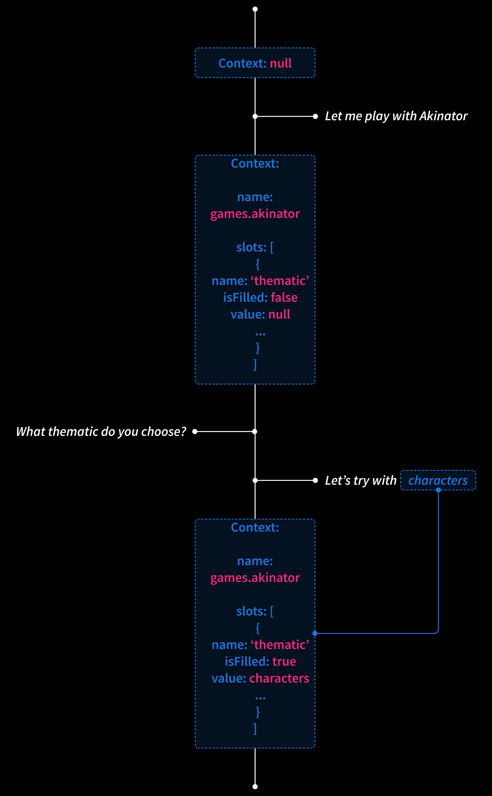

👋 Hey all, over the last months I've been working on trying to drastically improve the NLP capabilities of Leon so we can create more advanced skills in the future. But not only.

There are so many things I want to share with you right now, that's one of the reasons I started to work on Leon at the first place. Not only to work on the code itself, but also think about the structure of such project as it is scalable, very flexible and build up a whole community around it.

Indeed, before the official release of Leon many things have to be done to make sure that we have a respectable personal assistant who is extended by skills that can cover many scenarios and properly respect our privacy. Hence these new capabilities I will share with you shortly.

Please get comfy, it may be a bit long for some of us, sorry about that. But I have so many things to share! I tried my best to illustrate with images.

At the end of this blog post I will also share toward what Leon is heading to.


### From Modules to Skills

As of now, "modules" and "packages" no longer exist. Instead, they've been replaced by "skills". This involve a change in the naming of how we define components of Leon that extend the core to do meaningful things (e.g. Music skill, Forecast skill, etc.). But most importantly, it required a major change in the structure.

#### New Vocabulary

When I released Leon at the first place, I found that "module" and "package" terms were easy to remember. However, now I found it can be somehow confusing.

"Module" is a broadly used term out there, it can define a CommonJS/ES module, a Python module, etc. "Package" is also widely used, such as for npm packages or even Python packages. So I find it's misleading to call such components for Leon in this way as it can also refer to things that aren't directly related to Leon.

Also, let's call a cat a cat, when you hear "module" or "package" for Leon, it does not really ring a bell, we don't get what it is for without reading docs. Whereas "skill" can naturally be understood. Also it is used in some closed source assistants, so we kind of get used to it already.

Along with this change, there are also a few other terms that have changed:

- "Query" becomes "utterance". It is what the Leon owner (you, me, anybody who owns a Leon) says.

- "Expression" becomes "utterance sample". It is what is used at the NLU level to train a skill action so Leon understands what needs to be done.

#### New Structure

Not only the whole core of Leon is being rewritten, but the skills architecture too.

Leon now has a list of predefined domains which contain skills. You can think of a domain as a category.

For example:

- Games (domain)
  - Akinator (skill)
  - Guess the Number (skill)
  - Rock Paper Scissors (skill)
- Productivity (domain)
  - Todo List (skill)

Until now Leon contains 18 domains:


The main NLP model is trained by domains which allow to classify skills by particular segment/category. We call it domain classification.

This is such an important feature as Leon uses it to understand in what context he is currently in and then better prioritize following intents. Yes Leon has such capabilities now! You can read further to know more.

With the legacy packages/modules structure, they were no specific boundaries of how we define a package. Should we create a new package? Create a module in a particular package? For example, we had the Calendar package that included the Todo List module. But why a Calendar package? When module developers wanted to create a new skill, we often needed to discuss about where the module should be added. It wasn't clear.

Now it is pretty straight forward. A skill contains its own code base and does not share the NLU configuration (utterance samples, actions list, etc.) with any other skills as it was before with modules.

Each skill has its own isolated codebase now. So skill developers can be completely independent when building skills without to worry of messing up other skills.


##### skill.json

Each skill also contains a "skill.json" file. This file helps to describe a skill via some meta data so it can be consumed by external services in the future.

```json
{
  "name": "Todo List",
  "bridge": "python",
  "version": "1.0.0",
  "description": "Manage your lists and items they contain.",
  "author": {
    "name": "Louis Grenard",
    "email": "louis.grenard@gmail.com",
    "url": "https://github.com/louistiti"
  }
}
```

Do you foresee where we are heading to here? As the community grows, a skills platform (like a registry) containing all skills to be downloaded and so one will be necessary. Perhaps a skills manager/installer like pip or npm too...

##### Skills Memory Sharing

As skills codebase is completely isolated from each other, so is their memory. But it is also possible to access skill memory across skills now!

There are many scenarios where we want a skill from a completely different domain hold data, and be able to consume these data from another skill.


### Context Switching

Don't create image here... Create image of how it works under the hood ... Small timeline showing classifications prioritization with newly set context and hold entities, so can omit required entities

A context is identified by a domain + skill name.

Classification prioritization belonging to the same domain first. It helps with 2 (or 4?) things:

Add bread to the shopping list; Actually, remove it

And reduce conflicts of executing skill actions that belongs to other domains

...

#### Action Loop

... Create image of how it works under the hood ... Make use of a loop schema somehow. Prepare next action in advance and won't quit context as long as in current one

...

#### Slot Filling



...

### A More Powerful NER


Entities
- Built in (Microsoft) https://www.npmjs.com/package/@microsoft/recognizers-text-suite
- spaCy
- Custom (scoped in the skill action)
  - Trim
  - Enum
  - Regex
- Global

Leon has a custom TCP server and TCP client to be able to do IPC (Inter-Process Communication). Split spaCy location into cities and countries
In our case, spaCy. Makes use of PyTorch?
New entities: person, cities, countries, organizations

...

#### Global Entities

Colors, etc.

Map data to global entities

...

### Action Types

Logic type
Dialog type
Reuse entities values in answers @number (in utterance); {{ number }} (in answer)

Variables in the NLU
...

### Language Switching

... Share screenshot ...

...

### Introducing Suggestions

... Share screenshot ...

On action level...
On slot level...

Dialog + slots: show automatically
Logic: need to be triggered from skill:
  - showNextActionSuggestions (next action)
  - showSuggestions (current action)

...

### Resolvers

... Create image of how it works under the hood ... Split schema in separate models...

Use a separate model...

...

#### Global Resolvers

Use their own NLP model.

...

#### Skill Resolvers

Use their own NLP model.

...

### Cartesian Training Samples

... Provide examples ...

...

### Traceback from Skills to Core

Easier for skills developers...
Don't kill the main process when an error is occurring from a skill...
Auto enable a debug output on print from skills...

### New Skills

Basically to apply a real world use case into these newly introduced concepts...

### What's Next?

With such NLP foundations, we will be able to imagine and realize an infinity of skills. Such expendable architecture is one of the main strength of Leon since day one.

New core features still need to see the light of day to have a decent personal assistant

Thanks to this core, I'll be focusing on making it easier for skills developers to extend Leon. The next big milestones before the official release will be:

#### 1. TypeScript Rewrite

...

#### 2. Python SDK

...

#### 3. JavaScript Bridge and TypeScript SDK

...

#### 4. Widgets

...

#### 5. Mini Apps

...

#### 6. Languages Scaling

...

#### 7. New STT/TTS Offline and Cloud Solutions

...

#### 8. Skills Platform

...

### Important Notes

Until the official release, I do not recommend new contributions as the whole architecture is constantly being revisited.

Also, please know that before the official release no docs is going to be written because of all the major upcoming features that may bring up breaking changes.

Once the official release shipped, the big focus will be to build many skills along with the community and cover most of the basic cases and beyond of existing closed source assistants. If you have any questions or are willing to contribute to the bright future of Leon, **feel free to [join us on Discord](https://discord.gg/MNQqqKg). It's important, because later we will be growing the community all together!**

Ah I almost forgot... At the moment only the web app is available, but later imagine what we'll be able to do with native features of a mobile app and a desktop app based on the cool stuff mentioned earlier. These will come up after the official release.

For the mobile app, I'll probably go with React Native to stay somehow consistent between the Android and iOS version and also with the whole Leon stack.

Oh boy, so many things to think of!
