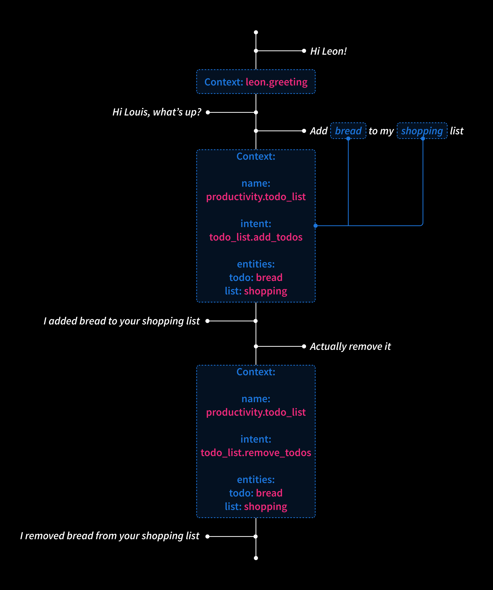
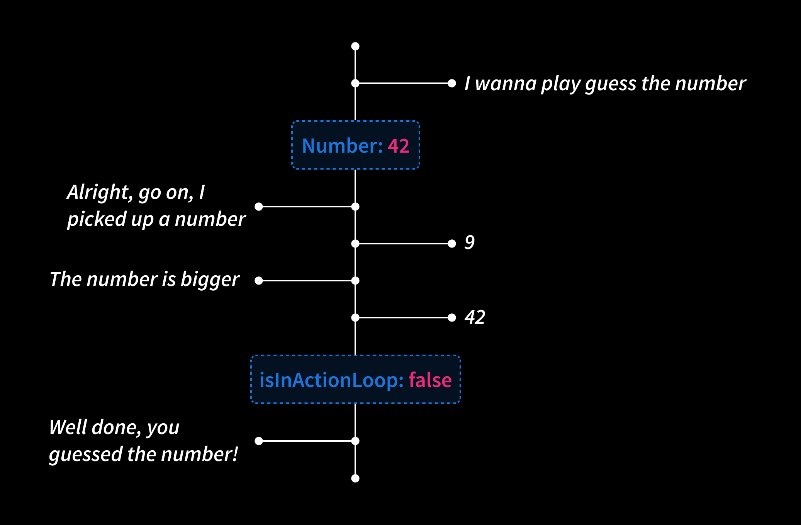
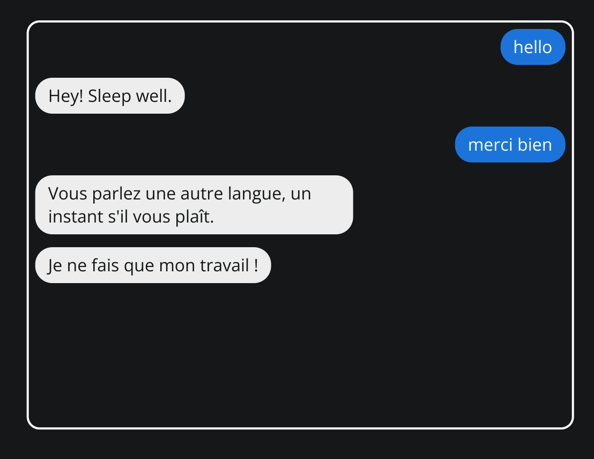
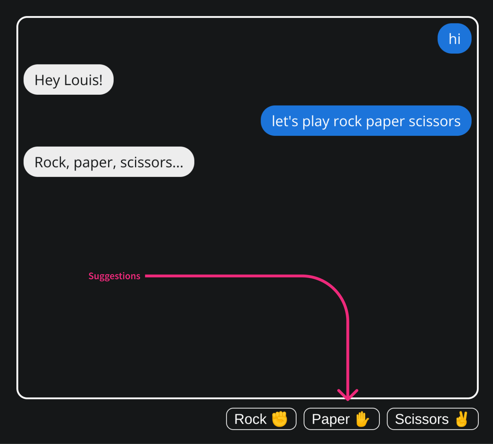

👋 Hey all, over the last months I've been working on trying to drastically improve the NLP capabilities of Leon so we can create more advanced skills in the future. But not only.

There are so many things I want to share with you right now, that's one of the reasons I started to work on Leon at the first place. Not only to work on the code itself, but also think about the structure of such project as it is scalable, very flexible and build up a whole community around it.

Indeed, before the official release of Leon many things have to be done to make sure that we have a respectable personal assistant who is extended by skills that can cover many scenarios and properly respect our privacy. Hence these new capabilities I will share with you shortly.

Please get comfy, it may be a bit long for some of us, sorry about that. But I have so many things to share! I tried my best to illustrate with images.

At the end of this blog post I will also share toward what Leon is heading to.


### From Modules to Skills

As of now, "modules" and "packages" no longer exist. Instead, they've been replaced by "skills". This involve a change in the naming of how we define components of Leon that extend the core to do meaningful things (e.g. Music skill, Forecast skill, etc.). But most importantly, it required a major change in the structure.

#### New Vocabulary

When I released Leon at the first place, I found that "module" and "package" terms were easy to remember. However, now I found it can be somehow confusing.

"Module" is a broadly used term out there, it can define a CommonJS/ES module, a Python module, etc. "Package" is also widely used, such as for npm packages or even Python packages. So I find it's misleading to call such components for Leon in this way as it can also refer to things that aren't directly related to Leon.

Also, let's call a cat a cat, when you hear "module" or "package" for Leon, it does not really ring a bell, we don't get what it is for without reading docs. Whereas "skill" can naturally be understood. Also it is used in some closed source assistants, so we kind of get used to it already.

Along with this change, there are also a few other terms that have changed:

- "Query" becomes "utterance". It is what the Leon owner (you, me, anybody who owns a Leon) says.

- "Expression" becomes "utterance sample". It is what is used at the NLU level to train a skill action so Leon understands what needs to be done.

#### New Structure

Not only the whole core of Leon is being rewritten, but the skills architecture too.

Leon now has a list of predefined domains which contain skills. You can think of a domain as a category.

For example:

- Games (domain)
  - Akinator (skill)
  - Guess the Number (skill)
  - Rock Paper Scissors (skill)
- Productivity (domain)
  - Todo List (skill)

Until now Leon contains 18 domains:


The main NLP model is trained by domains which allow to classify skills by particular segment/category. We call it domain classification.

This is such an important feature as Leon uses it to understand in what context he is currently in and then better prioritize following intents. Yes Leon has such capabilities now! You can read further to know more.

With the legacy packages/modules structure, they were no specific boundaries of how we define a package. Should we create a new package? Create a module in a particular package? For example, we had the Calendar package that included the Todo List module. But why a Calendar package? When module developers wanted to create a new skill, we often needed to discuss about where it should be added. It wasn't clear.

Now it is pretty straight forward. A skill contains its own codebase and does not share the skill configuration (utterance samples, actions list, etc.) with any other skills as it was before with modules.

Each skill has its own isolated codebase now. So skill developers can be completely independent when building skills without to worry about messing up other skills.


##### skill.json

Each skill also contains a "skill.json" file. This file helps to describe a skill via some meta data so it can be consumed by external services in the future.

```json
{
  "name": "Todo List",
  "bridge": "python",
  "version": "1.0.0",
  "description": "Manage your lists and items they contain.",
  "author": {
    "name": "Louis Grenard",
    "email": "louis.grenard@gmail.com",
    "url": "https://github.com/louistiti"
  }
}
```

Do you foresee where we are heading to here? As the community grows, a skills platform (like a registry) containing all skills to be downloaded and so on will be necessary. Perhaps a skills manager/installer like pip or npm too...

##### Skills Memory Sharing


As skills codebase are completely isolated from each other, so is their memory. But it is also possible to access skill memory across skills now!

There are many scenarios where we want a skill hold some data and be able to consume these data from another skill of a different domain.

### Context Switching



This is the most important improvement for the Leon's NLP. Introducing contexts makes Leon smarter and allow to do slot filling, prioritize classifications, build skills for natural conversations, etc. Contexts are the foundation of many aspects of Leon NLP capabilities.

A context is identified by a domain + a skill name. Each context holds several kind of data that come along conversations such as entities, slots, etc.

For us humans, It's very natural to understand contexts. If you speak about a blue color out of context, then what does it mean? Is it the color of a t-shirt, a car, a light? And why are we speaking about the blue color? Well, we know that thanks to contexts.

As you can see on the image above, "Remove it" is a pretty common thing that can be used in many other skills. But thanks to contexts, Leon knows it actually means to remove the todo from the list and not anything else. So utterance samples can be very general and not too specific and Leon will still understand according to contexts.

Shortly speaking, for Leon, when a skill action is triggered, he will set the current context based on the domain of the skill and the name of the skill.

When another action of the same skill is triggered, Leon knows we are in the same context. However, when an action from another skill is triggered, Leon will switch the context and understands he no longer uses the same set of data belonging to the previous context. But if the context is still the same domain, then Leon can prioritize intents better.

This can allow new capabilities.

I also implemented a contexts queue so in the future we can build deeper meaningful features based on previous contexts. Imagine what it would be possible to do if skills can access this contexts queue...

#### Action Loop

The action loop is a concept to keep Leon triggering the same skill action until the logic of the skill breaks the loop based on new utterances. In the skill configuration, you define a loop by telling Leon what item he needs to expect. An item can be a entity or a resolver (keep reading to understand what resolvers are). Leon will keep triggering the same skill action until it breaks.

A loop can break if the action explicitly stops it from the code. Or if the utterance does not contain the expected item, Leon will think you are changing topic and will break the loop by himself.

It may look blurry to say it like that, so let's take an example.



Let's say we have a Guess the Number skill where Leon picks up a number and let you guess it. The action configuration can look like this:

```json
"guess": {
  "type": "logic",
  "loop": {
    "expected_item": {
      "type": "entity",
   	  "name": "number"
    }
  }
}
```

Meaning Leon will trigger the "guess" action on upcoming utterances until the loop breaks. In this example, the loop expects an entity type of number. When the action returns a `isInActionLoop` to `false`, then the loop will break, probably because the Leon owner guessed the number.

#### Next Action

In a skill configuration, the `next_action` property is useful when a skill needs to follow a specific order of actions. It will help Leon to foresee and prepare for what's coming next. I will not go into details here as I don't think it is very relevant. Just understand that it helps to connect actions in a specific order to feed the context with data. Like you are creating a conversation flow.

Because not all actions need to be triggered from utterances. When an action ends, then Leon can be ready for what's coming next and trigger the next action based on the new utterance.

Okay, at least let's go for a simple example. Still with our Guess the Number skill, let's say we have the following configuration:

```json
{
  "actions": {
    "setup": {
      "type": "logic",
      "utterance_samples": [
        "Let's play guess the number",
        "I wanna play guess the number"
      ],
      "next_action": "guess"
    },
    "guess": {
      "type": "logic",
      "loop": {
        "expected_item": {
          "type": "entity",
          "name": "number"
        }
      },
      "next_action": "replay"
    },
    "replay": {
      "type": "logic",
      "loop": {
        "expected_item": {
          "type": "global_resolver",
          "name": "affirmation_denial"
        }
      }
    }
  }
}
```

1. We have a `setup` action as the entry point. This is what will start the flow of our conversation. This action contains a `next_action` property with the `guess` value. Meaning Leon will activate the loop inside the `guess` action.
2. Once the number is found, then Leon will be disposed to trigger the `replay` action.
3. This `replay` action expects the `affirmation_denial` global resolver, so basically, Leon expects a `yes` or `no` answer (again, I will explain resolvers later in this blog post).

As you can see here only the first action requires utterance samples. Then everything comes up with a flow.

### Slot Filling


Depending on how skill developers wants to design their skill, they have the possibility to ask for more information before to get to the meat of the skill. In this way, Leon can gather these information to operate the skill in a complete manner.

On the image above, you can see for the Akinator skill, Leon asks what thematic you want to play with. Then according to the thematic, Leon's friend Akinator, will try to guess within the chosen thematic.

Skill developers can use their imagination to design nice scenario with such features.

### A More Powerful NER


Still in the purpose of improving the NLP of Leon, NER (*Natural Entity Recognition*) plays a big part here. It is what helps Leon to identity/target specific information we provide such as a location, date, duration and so on...

I worked in improving the NER by adding two new group of entities: global entities and spaCy entities. In this way Leon's NER contains a total of four groups:

#### Built-In Entities

This group already existed, it is based on the [Microsoft recognizers](https://www.npmjs.com/package/@microsoft/recognizers-text-suite). It helps to understand daily entities such as dimensions, emails, numbers. etc. They don't require any settings in skills configuration, Leon naturally understands them.

#### Custom Entities

This group contains 3 types:

- Trim: you can pick up a data from an utterance by clearly defining conditions. E.g. pick up what is after the last "with" word of the utterance.
- Regex: you can create an entity based on a regex.
- Enum: define a bag of words and synonyms that should match your new entity.

#### Global Entities

This new group of entities are the one that can be reused among skills. And you can define them! A good example here is a color entity that can be defined as global. Because such entity can for sure be reused in other skills. It is not specific to a skill. So other skill developers can use your global entity to also fulfill their needs.

Global entities can hold data that can directly be reused in skills. You can see an example by reading further.

At the moment, global entities only support the enum type. Let's see if other types should be supported in the future.

#### spaCy Entities

I wanted Leon to be able to recognize new types of entities such as: person names, cities, countries and organizations.

To do so, I created a TCP server and a TCP client to allow IPC (*Inter-Process Communication*) between spaCy model which uses a layer of Python and the core of Leon which uses Node.js.

spaCy entities are naturally understood by Leon, no skill configuration is needed too.

Moreover, these TCP instances can be helpful for the future of Leon if we need to add other layers to Leon that runs in separate processes.

### Action Types

Some skills don't actually need code to run. For example, at present if we use code for the Good Bye skill, the main action would look like this:

```python
import utils

def run(params):
	"""Leon says good bye"""

	return utils.output('end', 'good_bye')
```

So here Leon actually just answers without any business logic. Hence the introduction of action types.

From now on each action is defined with a *dialog* or *logic* type.

#### Dialog Type

The dialog type is perfect to be used when no real business logic needs to be executed.

For example, the Good Bye skill simply uses the skill configuration without any code written:

```json
"actions": {
  "run": {
    "type": "dialog",
    "utterance_samples": [
      "Bye",
      "See you later"
    ],
    "answers": [
      "Bye! Enjoy your time!"
    ]
  }
}
```

Leon will automatically pick up an answer from this action when the Good Bye skill is triggered. It is also possible to create dialogs with this type. Let's take an example with a Color skill.

Let's say we have 3 actions within the Color skills:

- favorite_color: Leon tells about his favorite color.
- why: Leon justifies why it is his favorite color.
- color_hexadecimal: Leon tells you about the hexadecimal code of a color.

For the skill configuration, we can consider this:

```json
{
  "variables": {
    "blue_leon": "#1C75DB",
    "pink_leon": "#ED297A"
  },
  "actions": {
    "favorite_color": {
      "type": "dialog",
      "utterance_samples": [
        "What is your favorite color?",
        "I love the @color color, how about you?"
      ],
      "answers": [
        "Sometimes %blue_leon%, sometimes %pink_leon%.",
        "{{ color }} is great! But I prefer blue and pink."
      ]
    },
    "why": {
      "type": "dialog",
      "utterance_samples": [
        "Why?"
      ],
      "answers": [
        "Because blue and pink are beautiful. Look at my logo..."
      ]
    },
    "color_hexadecimal": {
      "type": "dialog",
      "utterance_samples": [
        "Give me the hexadecimal code of the @color color"
      ],
      "answers": [
        "Alright, here is for the {{ color }} color: {{ color.hexa }} <div style=\"background:{{ color.hexa }};display:inline-block;width:12px;height:12px;border-radius:50%;\"></div>."
      ],
      "unknown_answers": [
        "This color must look incredible, but I haven't seen it before."
      ]
    }
  },
  "entities": {
    "color": "global-entities/color.json"
  }
}
```

All of this without writing a single line of code!

And our global entity "color" file can look like this:

```json
{
  "options": {
    "blue": {
      "synonyms": ["blue"],
      "data": {
        "hexa": ["#0000FF"]
      }
    },
    "gray": {
      "synonyms": ["gray", "grey"],
      "data": {
        "hexa": ["#808080"]
      }
    },
    "pink": {
      "synonyms": ["pink"],
      "data": {
        "hexa": ["#FFC0CB"]
      }
    }
  }
}
```

On the dialog type, if an utterance uses an entity, Leon is smart enough to reply automatically with an answer that includes your entity value if he wants to. For example:

```
I love the @color color, how about you?
```

`@color` is the entity, and let's say it has the `blue` value. Then Leon will reply either:

```
Sometimes %blue_leon%, sometimes %pink_leon%.
```

Either:

```
{{ color }} is great! But I prefer blue and pink.
```

`{{ color }}` will be replaced by `red`.

The entity can be any type of entity, it can be a global one, or a built-in one such as `@number`, `@date`, or a custom one, etc.

However, if you don't give any entity in the utterance, Leon will reply with a sentence that does not include the entity. Which is pretty normal right?

Also, have you noticed the new variables feature here? You can now specify some variables in your skill configuration to avoid repetitions.

After Leon tells you about his favorite color, you can ask why he likes this color. Then as there is a "why" action within this skill, thanks to the context, Leon will understand that you are asking why he likes these colors and not let's say... Why he likes to eat chocolate... Once again, context here is really helpful. It gives the possibility to create such dialogs.

In our color global entity file, you can see that we can hold some custom data. In our case the hexadecimal code for each colors. In that way, you can reuse these data within your skill configuration by using the following format: `{{ color.hexa }}`. This very handy and you can think of any kind of data here. Remember, imagination is the only limit!

#### Logic Type

There is no much to say for this type. It is the same as we already know so far. It runs the business logic implemented in actions via code.

### Language Switching



Leon is now capable of detecting a language and switches from one language to another without restarting himself.

### Introducing Suggestions



When creating skills, skill developers can add suggestions at the actions level and at the slots level.

Suggestions are a simple way to suggest Leon owners what can be answered next. Owners can simply click or tap to reply.

On a skill with a dialog type, if suggestions are added in a slot, then they will show up automatically.

For logic skills type, suggestion can be added at the action and slot level, but they have to be triggered from the action code via the "showNextActionSuggestions" (show suggestions of the next action) or "showSuggestions" (show suggestions of the current action) options.

Don't worry, a better explanation will come up with the documentation before the official release. Just know that suggestions exist.

### Resolvers

I'm thrilled to introduce revolvers.

You can see resolvers as utterance samples that are converted (resolved) to a value of your choice.

They are very handy when skills expect specific utterances and then according to these utterances attribute a value that can be handled by the skill.

If a skill action expects to receive a resolver, then Leon will convert the value for you and this value will be usable from the skill action code. Any value can be passed to resolvers which allow a large possibilities of usages.

There are two types of resolvers. Let's take a look.

#### Global Resolvers


Global resolvers are the ones used for common purposes so they can easily be reused by skills. They are defined at a high level in the Leon's structure.

For example, the purpose of the "affirmation_denial" resolver is to affirm or deny something, just a "yes" or "no" question. Like "Would you try again?", such case is very common, therefore this global resolver exists and can easily be used by skills.

It looks like this (it is longer in reality):

```json
{
  "name": "affirmation_denial",
  "intents": {
    "affirmation": {
      "utterance_samples": [
        "Yes",
        "Alright",
        "Do [it|this|that]",
      ],
      "value": true
    },
    "denial": {
      "utterance_samples": [
        "No",
        "Stop it",
        "Please don't",
      ],
      "value": false
    }
  }
}
```

In the skill configuration we can set such resolver at the skill action level via the following:

```json
"retry": {
  "type": "logic",
  "loop": {
    "expected_item": {
      "type": "global_resolver",
      "name": "affirmation_denial"
    }
  }
}
```

Global resolvers have their own NLP model to not have any conflict with the main NLP model which contains skills intents. This type of resolvers is classified within a special NLP domain called "system" so Leon can recognize they are a special case somehow.

#### Skill Resolvers


Skill resolvers are the same as global resolvers except that they are located at the skill level. They also have their own NLP model but they are classified in the same domain as the skill they live in.

These resolvers are specific to skills and cannot be reused by other skills.

For example, the MBTI skill which provides a quiz to know your personality type relies on a skill resolver. This resolver contains forty intents. Each intent represents a choice of the quiz and is identified by a value such as "1_b" for "the first question, choice B".

So the "1_b" value can be manipulated from the skill action.

### Cartesian Training Samples

To train the main NLP model, we need to provide utterance samples for each action of all skills. However, sometimes it can be redundant to have some sort of repetitions in our utterance samples.

Let's take an example. To train the "add todos" action of our Todo List skill, we can have the following samples:

```json
"utterance_samples": [
  "Add potatoes to the groceries list",
  "Add potatoes to my groceries list",
  "Append potatoes to the groceries list",
  "Append potatoes to my groceries list"
]
```

This is somehow redundant. So now it is possible to provide the same result within one line:

```json
"utterance_samples": [
  "[Add|Append] potatoes to [the|my] groceries list"
]
```

### Traceback from Skills to Core

So far, when a code issue happened at the skill level, Leon was exiting his main process. And yes, it was frustrating for skill developers, and also for Leon owners if the call stack was reaching these scopes.

Now this has been fixed and the main process won't be killed when an error occurs from a skill. It'll be way easier for skill developers to build new skills without restarting the Leon main process.

And if an error occurs, it will now return the full traceback so it's easier to spot and fix:


Also, a debug mode is automatically triggered once skill developers prints directly on the child process output from skills so it's easier to see what's going on.


### New Skills

Basically to apply these new concepts to real world use cases, new skills needed to be made. These skills aren't very important, but the concepts of the core and what's coming next are.

These new skills are: Akinator, Rock Paper Scissors, Guess the Number, Color, MBTI. And some already-existing skills got some twists as per the new features.

### What's Next?

With such NLP foundations, we will be able to imagine and realize an infinity of skills. Such expendable architecture is one of the main strength of Leon since day one.

New core features still need to see the light of day to have a decent personal assistant.

Thanks to this core, I'll be focusing on making it easier for skills developers to extend Leon. The next major milestones before the official release will be:

#### 1. TypeScript Rewrite

Leon's codebase keeps growing and it's not going to stop anytime soon. When I started to build Leon at the first place (late 2017), I was afraid to use TypeScript because I thought it would prevent some people to contribute to the core as TypeScript wasn't as well adopted as it is today. Now is the time!

#### 2. Python SDK

To help skill developers to build new skills, an SDK needs to be built. Currently it uses some kind of helper functions to access memories, return response, etc. But as the community grows, defining a proper standard and a clean SDK will help to be more productive and organized when building skills.

#### 3. JavaScript Bridge and TypeScript SDK

Today it is only possible to build new skills with Python. But I want that many developers or even hobbyist developers can build new skills that fit their own specific needs. Also it has been requested several times by the community, so the need is there.

Same as for Python, a TypeScript SDK will be built. This SDK will follow the same standards as the Python SDK.

When building a new skill, it'll be up to developers to choose whether they want to use Python or TypeScript.

#### 4. Widgets

Currently Leon can use some HTML as output for his answers. Well, this needs to be standardized too!

By making use of the SDKs, it'll be possible for Leon to return some chunks of UI divided into UI components. Imagine a Forecast skill where you see a widget containing the weather for each day of your week. We can think of a Card, Button, Icon, Image, Chart, etc. components. I started to brainstorm on [this roadmap card](https://trello.com/c/g4L8Fivr/424-%E2%9C%A8-100-beta11-introducing-widgets).

It can look similar as this:


#### 5. Mini Apps

I want to go even further than widgets.

Widgets are good to return chunks of UI based on some utterances we may tell to Leon. But what if a skill needs a dedicated UI not necessary triggered by utterances? An utterance may be too long to speak or write, so what if we can grab a mini app on demand? Such as:

```
Leon, grab the budget tracker skill.
OR
Leon, grab the budget tracker mini app.
OR a simple shortcut on the client (web app, mobile, etc.)
```

Then this will open a mini app in full screen with its own UI. The UI will still follow specific design guidelines exposed by SDKs so it will be consistent across all mini apps. Then we could browse and see charts of our expenses per category, etc. like on a classic app. But this app will be very easy to build as it extends from the core and SDKs of Leon! Skill developers just need to focus on the business logic, nothing more.

But we may think of why not simply use existing applications out there? Well, I'd say that one of the ultimate purpose of Leon is to centralize everything into one place. By "everything" I mostly mean our data. Doing so will also help to create very interesting scenarios among skills and also preserve our privacy. Use your imagination. It may be a long road, but we have to go through this.

The UI will use the skill memory to fetch/push data. And the same data can be consumed by actions of the skill. It's up to the skill developer to expose these data over the NLU entry.

Simple mini apps can also be made, such as "Roll Dices" or "Flip Coin" mini apps. The Leon server can host a Three.js version that can be consumed to build such small mini apps and display some rolling dices.

At the moment I think I will go for React for widgets and mini apps. So it will be consistent with the upcoming mobile app as it will be based on React Native.

I started to brainstorm on [this roadmap card](https://trello.com/c/SMCjN5GP/425-%E2%9C%A8-100-beta12-introducing-mini-apps).

#### 6. Languages Scaling

This one is tricky in my opinion. We already have several people who are willing to contribute to support more languages, which is awesome.

But maybe some skills will not support some languages. Or maybe we need to define ahead what languages have to be supported to consider a skill completed. The thing is that to support new languages it's not only about translating utterance samples and answers. It also needs to review and define the whole configuration of a skill, especially to spot some specific custom entities in an utterance.

Maybe some tooling will need to be made to help with that. Like some offline auto translation and so on. Let's see. But yeah, this part is very important too.

A lot of "maybes" here because this part is still obscure.

#### 7. New STT/TTS Offline and Cloud Solutions

The voice technology field has evolved a lot over the last few years. A lot of new offline solutions came up. So implementing new solutions is a must here so we can choose which ones fit the best. Still by prioritizing offline solutions to respect our privacy.

Ah and a new solution for the wake word is necessary too! I heard you.

#### 8. Skills Platform

I mentioned this one earlier. It has also been suggested by a community member.

At that time, the official release will be very close. So it'll be time to grow Leon capabilities by developing many skills. To do so, the community needs to be involved, so it would be nice to have a platform to centralize all skills that can be downloaded or being developed or waiting to be developed.

For skills that are available, we will have 3 types:
- Official: maintained by the Leon AI core Team.
- Trusted: created by the community, but approved by the Leon AI core Team.
- Unofficial: hasn't been reviewed.

This platform will also help to bring the community together.

### Important Notes

Something else I'll need to take a look at is to support Leon on single-board computers such as Raspberry Pis. This has been requested a lot, and the need is for sure existing. Same as for the IoT part (this one will be after the official release though).

Until the official release, I do not recommend new contributions as the whole architecture is constantly being revisited.

Also, please know that before the official release no docs is going to be written because of all the major upcoming features that may bring up breaking changes.

Once the official release shipped, the big focus will be to build many skills along with the community and cover most of the basic cases and beyond of existing closed source assistants. If you have any questions or are willing to contribute to the bright future of Leon, **feel free to [join us on Discord](https://discord.gg/MNQqqKg). It's important, because later we will be growing the community all together!**

Ah I almost forgot... At the moment only the web app is available, but later imagine what we'll be able to do with native features of a mobile app and a desktop app based on the cool stuff mentioned earlier. These will come up after the official release.

For the mobile app, I'll probably go with React Native to stay somehow consistent between the Android and iOS version and also with the whole Leon stack.

Oh boy, so many things to think of!

Meanwhile, you can try Leon within two command lines:

```bash
npm install --global @leon-ai/cli
leon create birth
```

Going to kick off the TypeScript rewrite, see ya!
