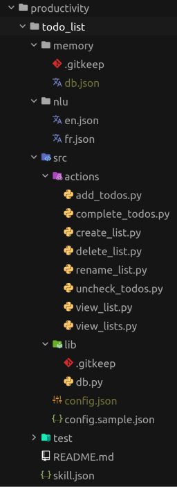
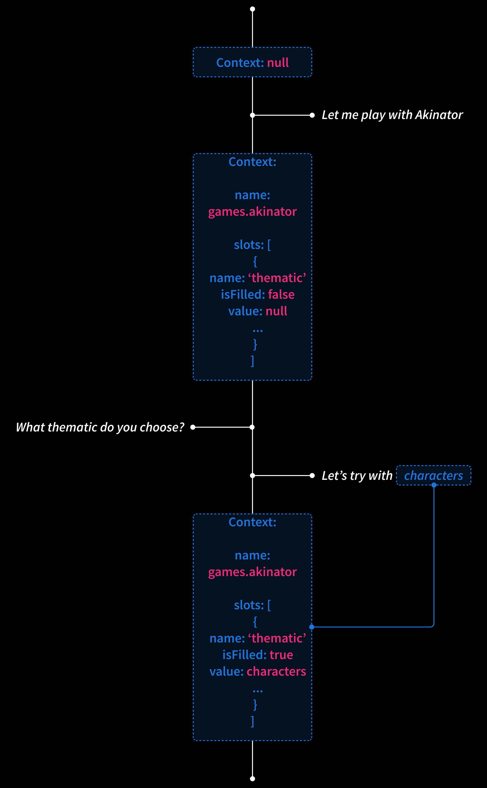
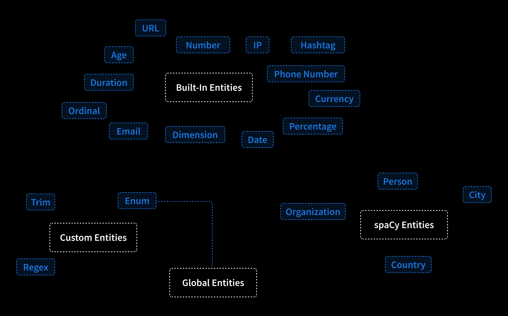
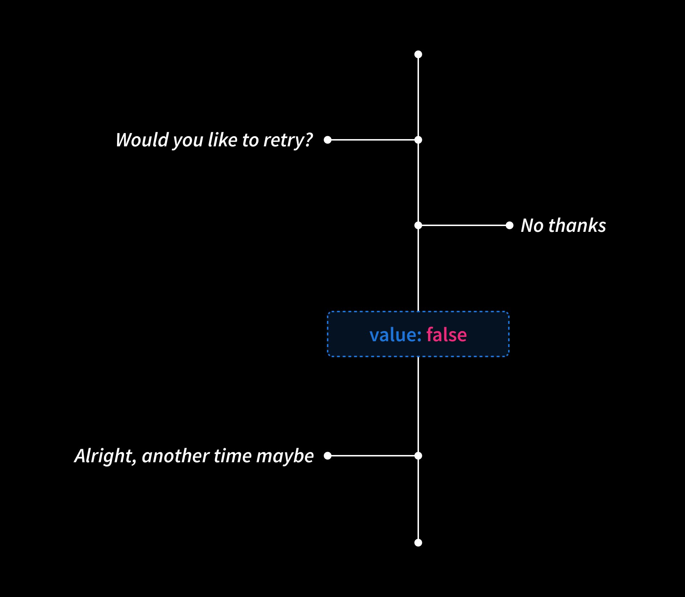
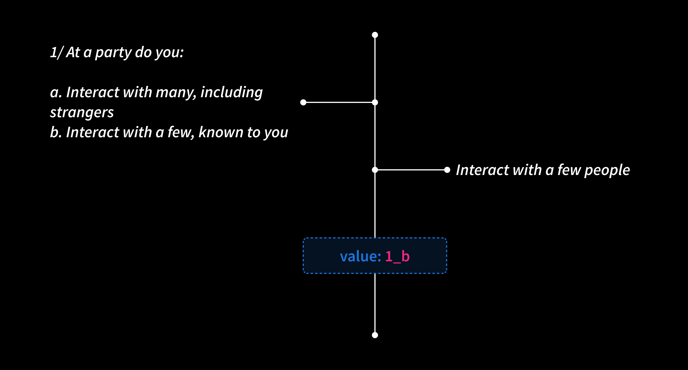
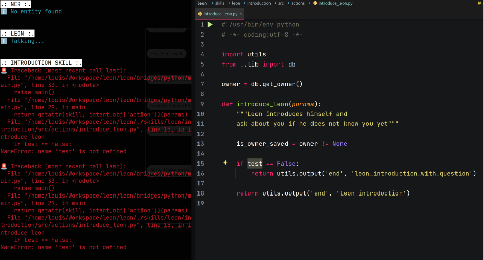
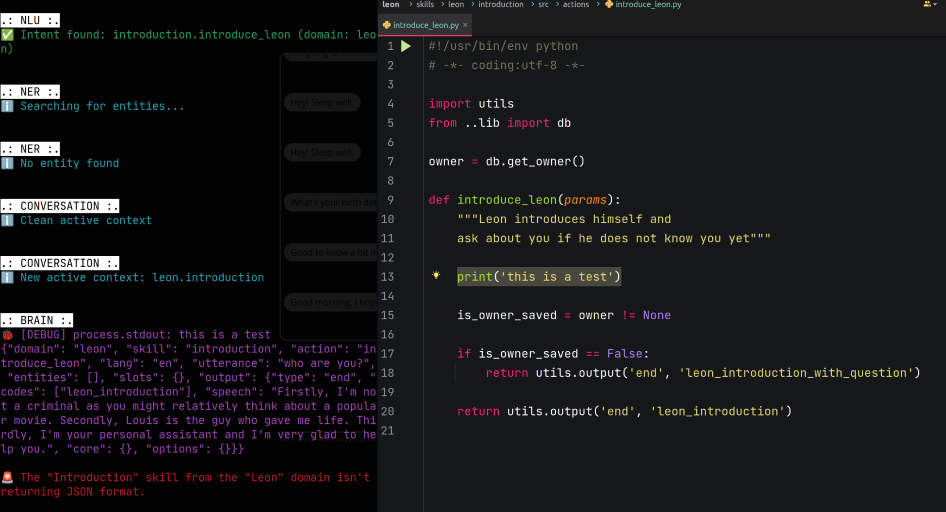
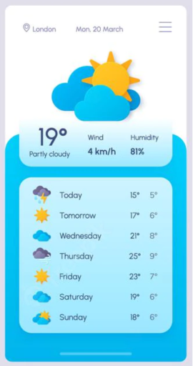

👋 Hey all, over the last months I've been working on trying to drastically improve the NLP capabilities of Leon so we can create more advanced skills in the future. But not only.

There are so many things I want to share with you right now, that's one of the reasons I started to work on Leon at the first place. Not only to work on the code itself, but also think about the structure of such project as it is scalable, very flexible and build up a whole community around it.

Indeed, before the official release of Leon many things have to be done to make sure that we have a respectable personal assistant who is extended by skills that can cover many scenarios and properly respect our privacy. Hence these new capabilities I will share with you shortly.

Please get comfy, it may be a bit long for some of us, sorry about that. But I have so many things to share! I tried my best to illustrate with images.

At the end of this blog post I will also share toward what Leon is heading to.


### From Modules to Skills

As of now, "modules" and "packages" no longer exist. Instead, they've been replaced by "skills". This involve a change in the naming of how we define components of Leon that extend the core to do meaningful things (e.g. Music skill, Forecast skill, etc.). But most importantly, it required a major change in the structure.

#### New Vocabulary

When I released Leon at the first place, I found that "module" and "package" terms were easy to remember. However, now I found it can be somehow confusing.

"Module" is a broadly used term out there, it can define a CommonJS/ES module, a Python module, etc. "Package" is also widely used, such as for npm packages or even Python packages. So I find it's misleading to call such components for Leon in this way as it can also refer to things that aren't directly related to Leon.

Also, let's call a cat a cat, when you hear "module" or "package" for Leon, it does not really ring a bell, we don't get what it is for without reading docs. Whereas "skill" can naturally be understood. Also it is used in some closed source assistants, so we kind of get used to it already.

Along with this change, there are also a few other terms that have changed:

- "Query" becomes "utterance". It is what the Leon owner (you, me, anybody who owns a Leon) says.

- "Expression" becomes "utterance sample". It is what is used at the NLU level to train a skill action so Leon understands what needs to be done.

#### New Structure

Not only the whole core of Leon is being rewritten, but the skills architecture too.

Leon now has a list of predefined domains which contain skills. You can think of a domain as a category.

For example:

- Games (domain)
  - Akinator (skill)
  - Guess the Number (skill)
  - Rock Paper Scissors (skill)
- Productivity (domain)
  - Todo List (skill)

Until now Leon contains 18 domains:


The main NLP model is trained by domains which allow to classify skills by particular segment/category. We call it domain classification.

This is such an important feature as Leon uses it to understand in what context he is currently in and then better prioritize following intents. Yes Leon has such capabilities now! You can read further to know more.

With the legacy packages/modules structure, they were no specific boundaries of how we define a package. Should we create a new package? Create a module in a particular package? For example, we had the Calendar package that included the Todo List module. But why a Calendar package? When module developers wanted to create a new skill, we often needed to discuss about where the module should be added. It wasn't clear.

Now it is pretty straight forward. A skill contains its own codebase and does not share the NLU configuration (utterance samples, actions list, etc.) with any other skills as it was before with modules.

Each skill has its own isolated codebase now. So skill developers can be completely independent when building skills without to worry about messing up other skills.



##### skill.json

Each skill also contains a "skill.json" file. This file helps to describe a skill via some meta data so it can be consumed by external services in the future.

```json
{
  "name": "Todo List",
  "bridge": "python",
  "version": "1.0.0",
  "description": "Manage your lists and items they contain.",
  "author": {
    "name": "Louis Grenard",
    "email": "louis.grenard@gmail.com",
    "url": "https://github.com/louistiti"
  }
}
```

Do you foresee where we are heading to here? As the community grows, a skills platform (like a registry) containing all skills to be downloaded and so on will be necessary. Perhaps a skills manager/installer like pip or npm too...

##### Skills Memory Sharing

As skills codebase are completely isolated from each other, so is their memory. But it is also possible to access skill memory across skills now!

There are many scenarios where we want a skill hold some data and be able to consume these data from another skill from a completely different domain.


### Context Switching

Don't create image here... Create image of how it works under the hood ... Small timeline showing classifications prioritization with newly set context and hold entities, so can omit required entities

A context is identified by a domain + skill name.

Classification prioritization belonging to the same domain first. It helps with 2 (or 4?) things:

Add bread to the shopping list; Actually, remove it

And reduce conflicts of executing skill actions that belongs to other domains

...

#### Action Loop

... Create image of how it works under the hood ... Make use of a loop schema somehow. Prepare next action in advance and won't quit context as long as in current one

...

#### Slot Filling



...

### A More Powerful NER



Entities
- Built in (Microsoft) https://www.npmjs.com/package/@microsoft/recognizers-text-suite
- spaCy
- Custom (scoped in the skill action)
  - Trim
  - Enum
  - Regex
- Global

Leon has a custom TCP server and TCP client to be able to do IPC (Inter-Process Communication). Split spaCy location into cities and countries
In our case, spaCy. Makes use of PyTorch?
New entities: person, cities, countries, organizations

...

#### Global Entities

Colors, etc.

Map data to global entities

...

### Action Types

Logic type
Dialog type
Reuse entities values in answers @number (in utterance); {{ number }} (in answer)

Variables in the NLU
...

### Language Switching

... Share screenshot ...

...

### Introducing Suggestions

... Share screenshot ...

On action level...
On slot level...

Dialog + slots: show automatically
Logic: need to be triggered from skill:

  - showNextActionSuggestions (next action)
  - showSuggestions (current action)

...

### Resolvers

I'm excited to introduce revolvers.

You can see resolvers as utterance samples that are converted (resolved) to a value of your choice.

They are very handy when skills expect specific utterances and then according to these utterances attribute a value that can be handled by the skill.

If a skill action expects to receive a resolver, then Leon will convert the value for you and this value will be usable from the skill action code. Any value can be passed to resolvers which allow a large possibilities of usages.

There are two types of resolvers. Let's take a look.

#### Global Resolvers



Global resolvers are the ones used for common purposes so they can easily be reused by skills. They are defined at a high level in the Leon's structure.

For example, the purpose of the "affirmation_denial" resolver is to affirm or deny something, just a "yes" or "no" question. Like "Would you try again?", such case is very common, therefore this global resolver exists and can easily be used by skills.

It looks like this (it is longer in reality):

```json
{
  "name": "affirmation_denial",
  "intents": {
    "affirmation": {
      "utterance_samples": [
        "Yes",
        "Alright",
        "Do [it|this|that]",
      ],
      "value": true
    },
    "denial": {
      "utterance_samples": [
        "No",
        "Stop it",
        "Please don't",
      ],
      "value": false
    }
  }
}
```

In the skill NLU configuration we can set such resolver at the skill action level via the following:

```json
"retry": {
  "type": "logic",
  "loop": {
    "expected_item": {
      "type": "global_resolver",
      "name": "affirmation_denial"
    }
  }
}
```

Global resolvers have their own NLP model to not have any conflict with the main NLP model which contains skills intents. This type of resolvers is classified within a special NLP domain called "system" so Leon can recognize they are a special case somehow.

#### Skill Resolvers



Skill resolvers are the same as global resolvers except that they are located at the skill level. They also have their own NLP model but they are classified in the same domain as the skill they live in.

These resolvers are specific to skills and cannot be reused by other skills.

For example, the MBTI skill which provides a quiz to know your personality type relies on a skill resolver. This resolver contains forty intents. Each intent represents a choice of the quiz and is identified by a value such as "1_b" for "the first question, choice B".

So the "1_b" value can be manipulated from the skill action.

### Cartesian Training Samples

To train the main NLP model, we need to provide utterance samples for each action of all skills. However, sometimes it can be redundant to have some sort of repetitions in our utterance samples.

Let's take an example. To train the "add todos" action of our Todo List skill, we can have the following samples:

```json
"utterance_samples": [
  "Add potatoes to the groceries list",
  "Add potatoes to my groceries list",
  "Append potatoes to the groceries list",
  "Append potatoes to my groceries list"
]
```

This is somehow redundant. So now it is possible to provide the same result within one line:

```json
"utterance_samples": [
  "[Add|Append] potatoes to [the|my] groceries list"
]
```

### Traceback from Skills to Core

So far, when a code issue happened at the skill level, Leon was exiting his main process. And yes, it was frustrating for skill developers, and also for Leon owners if the call stack was reaching these scopes.

Now this has been fixed and the main process won't be killed when an error occurs from a skill. It'll be way easier for skill developers to build new skills without restarting the Leon main process.

And if an error occurs, it will now return the full traceback so it's easier to spot and fix:



Also, a debug mode is automatically triggered once skill developers prints directly on the child process output from skills so it's easier to see what's going on.



### New Skills

Basically to apply these new concepts to real world use cases, new skills needed to be made. These skills aren't very important, but the concepts of the core and what's coming next are.

These new skills are: Akinator, Rock Paper Scissors, Guess the Number, Color, MBTI. And some already-existing skills got some twists as per the new features.

### What's Next?

With such NLP foundations, we will be able to imagine and realize an infinity of skills. Such expendable architecture is one of the main strength of Leon since day one.

New core features still need to see the light of day to have a decent personal assistant.

Thanks to this core, I'll be focusing on making it easier for skills developers to extend Leon. The next major milestones before the official release will be:

#### 1. TypeScript Rewrite

Leon's codebase keeps growing and it's not going to stop anytime soon. When I started to build Leon at the first place (late 2017), I was afraid to use TypeScript because I thought it would prevent some people to contribute to the core as TypeScript wasn't as well adopted as it is today. Now is the time!

#### 2. Python SDK

To help skill developers to build new skills, an SDK needs to be built. Currently it uses some kind of helper functions to access memories, return response, etc. But as the community grows, defining a proper standard and a clean SDK will help to be more productive and organized when building skills.

#### 3. JavaScript Bridge and TypeScript SDK

Today it is only possible to build new skills with Python. But I want that many developers or even hobbyist developers can build new skills that fit their own specific needs. Also it has been requested several times by the community, so the need is there.

Same as for Python, a TypeScript SDK will be built. This SDK will follow the same standards as the Python SDK.

When building a new skill, it'll be up to developers to choose whether they want to use Python or TypeScript.

#### 4. Widgets

Currently Leon can use some HTML as output for his answers. Well, this needs to be standardized too!

By making use of the SDKs, it'll be possible for Leon to return some chunks of UI divided into UI components. Imagine a Forecast skill where you see a widget containing the weather for each day of your week. We can think of a Card, Button, Icon, Image, Chart, etc. components. I started to brainstorm on [this roadmap card](https://trello.com/c/g4L8Fivr/424-%E2%9C%A8-100-beta11-introducing-widgets).

It can look similar as this:



#### 5. Mini Apps

I want to go even further than widgets.

Widgets are good to return chunks of UI based on some utterances we may tell to Leon. But what if a skill needs a dedicated UI not necessary triggered by utterances? An utterance may be too long to speak or write, so what if we can grab a mini app on demand? Such as:

```
Leon, grab the budget tracker skill.
OR
Leon, grab the budget tracker mini app.
OR a simple shortcut on the client (web app, mobile, etc.)
```

Then this will open a mini app in full screen with its own UI. The UI will still follow specific design guidelines exposed by SDKs so it will be consistent across all mini apps. Then we could browse and see charts of our expenses per category, etc. like on a classic app. But this app will be very easy to build as it extends from the core and SDKs of Leon! Skill developers just need to focus on the business logic, nothing more.

But we may think of why not simply use existing applications out there? Well, I'd say that one of the ultimate purpose of Leon is to centralize everything into one place. By "everything" I mostly mean our data. Doing so will also help to create very interesting scenarios among skills and also preserve our privacy. Use your imagination. It may be a long road, but we have to go through this.

The UI will use the skill memory to fetch/push data. And the same data can be consumed by actions of the skill. It's up to the skill developer to expose these data over the NLU entry.

Simple mini apps can also be made, such as "Roll Dices" or "Flip Coin" mini apps. The Leon server can host a Three.js version that can be consumed to build such small mini apps and display some rolling dices.

At the moment I think I will go for React for widgets and mini apps. So it will be consistent with the upcoming mobile app as it will be based on React Native.

I started to brainstorm on [this roadmap card](https://trello.com/c/SMCjN5GP/425-%E2%9C%A8-100-beta12-introducing-mini-apps).

#### 6. Languages Scaling

This one is tricky in my opinion. We already have several people who are willing to contribute to support more languages, which is awesome.

But maybe some skills will not support some languages. Or maybe we need to define ahead what languages have to be supported to consider a skill completed. The thing is that to support new languages it's not only about translating utterance samples and answers. It also needs to review and define the whole NLU configuration of a skill, especially to spot some specific custom entities in an utterance.

Maybe some tooling will need to be made to help with that. Like some offline auto translation and so on. Let's see. But yeah, this part is very important too.

A lot of "maybes" here because this part is still obscure.

#### 7. New STT/TTS Offline and Cloud Solutions

The voice technology field has evolved a lot over the last few years. A lot of new offline solutions came up. So implementing new solutions is a must here so we can choose which ones fit the best. Still by prioritizing offline solutions to respect our privacy.

Ah and a new solution for the wake word is necessary too! I heard you.

#### 8. Skills Platform

I mentioned this one earlier. It has also been suggested by a community member.

At that time, the official release will be very close. So it'll be time to grow Leon capabilities by developing many skills. To do so, the community needs to be involved, so it would be nice to have a platform to centralize all skills that can be downloaded or being developed or waiting to be developed.

For skills that are available, we will have 3 types:
- Official: maintained by the Leon AI core Team.
- Trusted: created by the community, but approved by the Leon AI core Team.
- Unofficial: hasn't been reviewed.

This platform will also help to bring the community together.

### Important Notes

Something else I'll need to take a look at is to support Leon on single-board computers such as Raspberry Pis. This has been requested a lot, and the need is for sure existing. Same as for the IoT part (this one will be after the official release though).

Until the official release, I do not recommend new contributions as the whole architecture is constantly being revisited.

Also, please know that before the official release no docs is going to be written because of all the major upcoming features that may bring up breaking changes.

Once the official release shipped, the big focus will be to build many skills along with the community and cover most of the basic cases and beyond of existing closed source assistants. If you have any questions or are willing to contribute to the bright future of Leon, **feel free to [join us on Discord](https://discord.gg/MNQqqKg). It's important, because later we will be growing the community all together!**

Ah I almost forgot... At the moment only the web app is available, but later imagine what we'll be able to do with native features of a mobile app and a desktop app based on the cool stuff mentioned earlier. These will come up after the official release.

For the mobile app, I'll probably go with React Native to stay somehow consistent between the Android and iOS version and also with the whole Leon stack.

Oh boy, so many things to think of!

Going to kick off the TypeScript rewrite, see ya!
