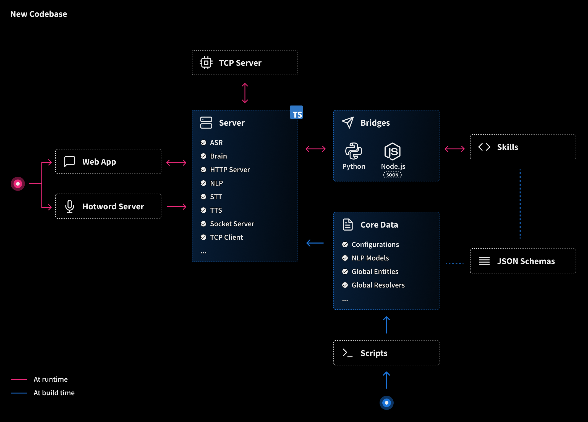

👋 Hello everyone, it's been a long time in the making, but I'm excited to announce the release of Leon beta 8! This version includes a range of new features and improvements that have been designed to enhance the performance, reliability, and usability of the project. In this blog post, I'll highlight the key features of this release and explain how they can benefit both you and the project as a whole.

I want to be transparent with you and share that the TypeScript rewrite was a challenging experience. Although it wasn't the most enjoyable task, it was essential for the future of Leon. In fact, it was almost like starting from scratch!


## What's New

### No Need of Python Environment Anymore

One of the major improvements in this release is that we've eliminated errors related to machine environments. Previously, when Leon executed skills, it required Python to be installed, as did the TCP server. To address this issue, I've worked on compiling the TCP server and the Python bridge into binaries, which means that Python is no longer needed at runtime! 🎉

This also means that there's no need for a Python environment when developing new skills, except when third-party packages not included in the Python bridge need to be added.

Although we've already simplified the setup process with the CLI, there were still a few edge cases. Now, a Python environment is only required when working on the TCP server or the Python bridge.

This change has also resulted in significant performance improvements, with skills execution being about five times faster than before. The only slight drawback we've noticed is that on macOS, there may be a bit of a slow start due to the cold start of binaries. However, this is a one-time occurrence, as the binaries are cached after the first load.

I'm happy to report that we've successfully compiled the TCP server and the Python bridge for various platforms, including Linux AArch64, Linux x86_64, macOS ARM64, macOS x86_64, and Windows AMD64.

I'd like to express my gratitude to [MacStadium](https://www.macstadium.com/), who provided us with a Mac mini M1 to make this possible for the macOS ARM64 platform.

Overall, this improvement simplifies the deployment and installation process, making Leon more portable and compatible with different platforms and environments.

### TypeScript Rewrite and New Architecture



As Leon's codebase continues to grow, it's become clear that we need a more robust and maintainable approach to development. When I first started building Leon back in late 2017, I was hesitant to use TypeScript, as I thought it might discourage some potential contributors who weren't familiar with the language. However, with the growing popularity of TypeScript, now is the perfect time to make the switch.

I'm thrilled to announce that with this beta version, we've completed the rewrite and refactoring of our codebase using TypeScript.

For those who aren't familiar, TypeScript is a superset of JavaScript that adds static type checking, class-based object-oriented programming, and other features that improve the maintainability, readability, and robustness of the code. By catching common coding errors at compile-time, rather than at runtime, we can save a lot of time and effort on debugging.

The refactoring of our codebase also includes a better file structure, which makes it easier to navigate and understand the code. We've also implemented singletons for core components, such as the natural language processing engine, the "brain", voice nodes, and more. This allows us to maintain a consistent state across the core and avoid inconsistencies and conflicts.

### Telemetry and Report Services

Telemetry and report services are crucial for understanding how an AI assistant like Leon is being used and identifying areas for improvement. To that end, we've developed a telemetry service that allows us to collect data about Leon's usage, performance, and errors.

We take privacy seriously, and that's why we anonymize all named entity values and ensure that the telemetry service does not store any data that could be used to identify individual owners. You can look at the [client code here](https://github.com/leon-ai/leon/blob/develop/server/src/telemetry.ts).

Our telemetry service was inspired by the series of articles on "[Transparent Telemetry for Open-Source Projects](https://research.swtch.com/telemetry-intro)," and we believe that it will be a valuable tool for improving the quality of Leon, identifying and fixing bugs, and optimizing resource usage.

To learn more about our telemetry services, check out [our GitHub repository](https://github.com/leon-ai/telemetry). And if you prefer not to participate in telemetry data collection, you can easily disable it using the `LEON_TELEMETRY` environment variable in the `.env` file located at the root of your Leon installation.

In addition to the telemetry service, we've also created a report service that makes it easy to diagnose and share the results of your Leon's state via a URL. The report service generates a summary of your Leon's health and provides data about the environment it's running in, which can help us gain a better understanding of where issues are occurring in different contexts.
When you run the following command:
```shell
leon check
```
A link containing your report will be generated so you can easily share it. Here is a [report example](https://report.getleon.ai/raw/hosituyeho).

### Moved Away from superagent to Axios

We've made a small but significant change to our HTTP client library. Specifically, we've switched from using the superagent npm package to the Axios npm package.

Axios is a widely-used HTTP client library for JavaScript and TypeScript that offers a range of features, such as interceptors, cancellation, automatic retries, and error handling. These features make it easier to handle HTTP requests and responses, and ensure a more efficient and reliable communication between the different nodes of the project.

By using Axios, we can handle errors and timeouts more gracefully, and ensure that our communication between nodes is more consistent and reliable. Overall, this change helps to improve the stability and performance of Leon, and ensures that we can continue to deliver high-quality results to you.

### Evaluating Socket.IO vs. Native WebSockets

We've been evaluating the use of Socket.IO versus native WebSockets for Leon's communication needs. While native WebSockets offer better flexibility and compatibility with custom clients, we've found that they add unnecessary complexity to the codebase, particularly when it comes to handling binary data such as audio forwarding.

To handle binary data with WebSockets, we would need to add a dedicated WebSocket path and ensure that it's handled properly in the event of a lost connection. This would require additional development time and could make the codebase more difficult to maintain.

Despite the fact that Socket.IO adds an additional layer to our communication protocol, we've decided to stick with it for the time being. We've found that it does most of the heavy lifting when it comes to handling complex communication scenarios, and it allows us to focus on other aspects of Leon's development.

While we'll continue to evaluate our communication needs and explore alternatives in the future, we believe that Socket.IO is currently the best option for Leon.

## Friendly Reminder

We want to remind you that Coqui STT currently does not work with Node.js 18 and macOS M1, and that our Watson STT/TTS is not functional at the moment. We apologize for any inconvenience this may cause, and we appreciate your patience as we work to resolve these issues.

We also want to remind you that we won't be rewriting any new documentation until the official release of Leon's core. This is because we want to ensure that our documentation is as accurate and up-to-date as possible, and we don't want to risk creating confusion or misinformation by releasing documentation that may change before the official release.

Finally, we want to invite you to [join us on Discord](https://discord.gg/MNQqqKg), where we'll be sharing updates and discussing the development of Leon's core. We believe that Discord will be the primary hub for community engagement and support once the core is released, and we encourage users to join us there to be a part of the conversation, share their feedback and most importantly create new skills together with many other skill developers.

## What's Next?

We have some exciting developments on the horizon for Leon! Over the next few weeks, our focus will be on developing the Python SDK and creating a JavaScript bridge and TypeScript SDK, which will allow us to create new skills using JavaScript.

If you're curious about our upcoming major milestones, you can check out [this link for more information](https://blog.getleon.ai/a-much-better-nlp-and-future-1-0-0-beta-7/#2-python-sdk). And also the [detailed roadmap](http://roadmap.getleon.ai/).

We want to remind you that contributions are still closed until the official release of the core is shipped. However, we welcome any feedback and suggestions, and we encourage you to share your thoughts and ideas with us as we work to improve Leon. We're excited about what's next for Leon, and we can't wait to share it with you all!