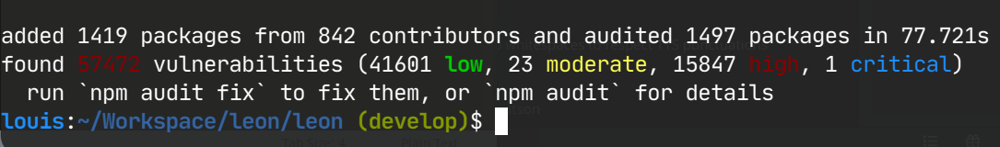
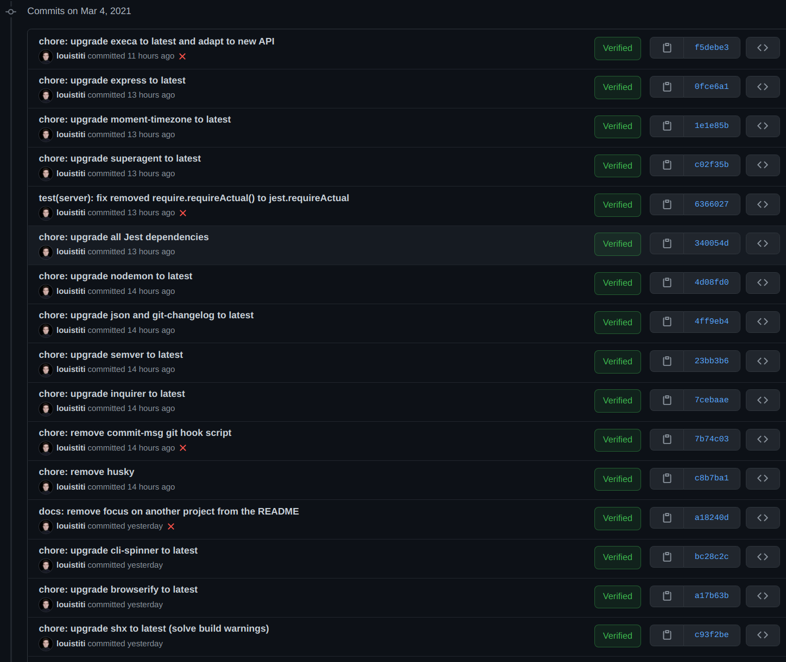
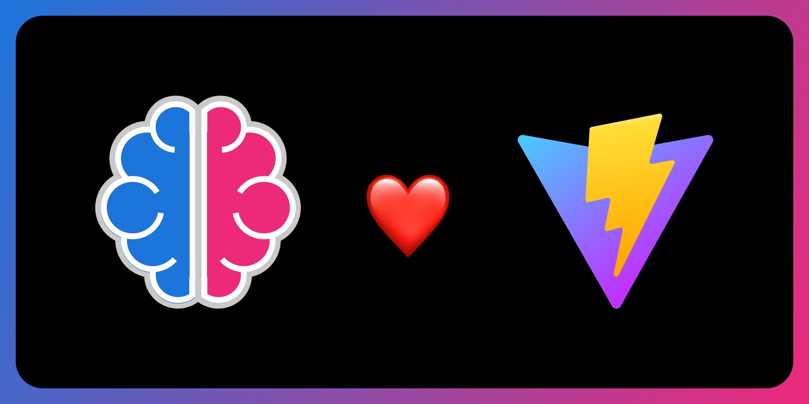
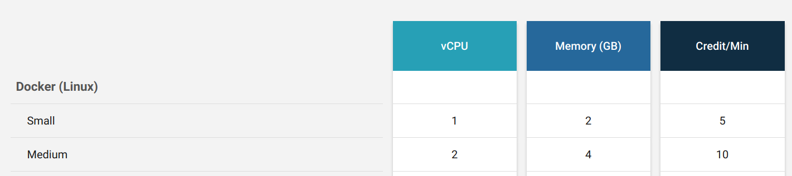
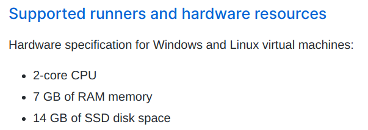

👋 Hey all, the time has come... Like **finally**! I know it has been a long time. The project has been paused for about 2 years. We'll talk about the reasons of this endless pause in another blog post.

Today, we'll focus on the new release of [Leon](https://github.com/leon-ai/leon) and understand what's new, where the project is leading to and the thinking process behind some decisions.

## Main Focus

The focus of this release is quite obvious. 2 years pause on a project requires a deep work on:

1. Rethinking about the project vision.
2. Redefining who would be interested in the project.
3. Analyzing technical debt and taking action.

At least that's how I put it together.

It's important to mention that the work here was not only technical. I needed to refocus on the **WHY** of Leon.

- Why did I build Leon at the first place?
- What problems is it solving?
- Is it still valuable today?

Let's focus on the technical part as the other part will be covered in another blog post.

### Dependency Updates

That is what happens when you don't update your project dependencies for about 2 years... Let images speak for themselves.

#### After a `npm install`



#### After a `npm run build`


#### How The Commit History Looked Like...



I believe you got a rough idea of what needed to be done. Clearly I **updated all dependencies that Leon relies on**. Of course I could make use of tools such as [Dependabot](https://dependabot.com/) but I preferred to update everything manually. It allowed me to have a better control of what I was doing and see if each dependency still has its seat in the project. Most of all, and this is only my own opinion, I prefer to keep dependency updates as a one-shot task instead of having noises in pull requests.

I read the changelog of each dependency to understand what has changed, has been improved and check if there was any breaking change.

You can find a list of all the updates [here](https://trello.com/c/TK2v9uxP/300-%E2%AC%86%EF%B8%8F-100-beta4-upgrade-dependencies-to-their-latest-version-clean-up).

#### Dropping Husky

Leon was using [Husky](https://typicode.github.io/husky/#/) that was triggering a script I wrote to parse a commit message on the [commit-msg](https://git-scm.com/docs/githooks#_commit_msg) Git hook.

It was working pretty well after the update, but GUI clients like [GitKraken](https://www.gitkraken.com/) was not working properly anymore due to their recent changes (it was working well before). So I decided to **drop Husky** or any Git hook trigger script because I don't want this be a bottleneck for contributors. So I keep it simple without commit restriction.

I believe that the [CONTRIBUTING.md](https://github.com/leon-ai/leon/blob/develop/.github/CONTRIBUTING.md#commits) file is enough to understand how to commit to the project. However, it's quite important to respect the commit convention as it eases the changelog generation for each new release.

#### Dropping Babel?

While [Babel](https://babeljs.io/) is an awesome JavaScript compiler, I was considering to drop it. Leon does not need to be ahead of current specifications, I felt it was a good choice to drop dependencies related to Babel as it'd lighten the dependency tree (which means faster install, less maintenance work and less potential security issue).

Moreover, since Node.js 14 we can [make use of experimental ECMAScript modules](https://nodejs.org/dist/latest-v14.x/docs/api/esm.html#esm_modules_ecmascript_modules) which are the official standard format to package JavaScript code for reuse. Node.js was only supporting [CommonJS (CJS) modules](https://nodejs.org/docs/latest/api/modules.html#modules_modules_commonjs_modules) before that.

But here is the thing, I want to continue to use the [`module-alias` npm package](https://www.npmjs.com/package/module-alias) as I find it brings better readability of the imports. I found that it requires to build a custom module loader to resolve it. I concluded that it was too much steps to achieve for a small output, then I chose to postpone the Babel dropping task. If you are interested into that specific case, there is an [ongoing GitHub issue](https://github.com/ilearnio/module-alias/issues/59).

I might **come back to this task once the ecosystem will be more ready**.

#### Raspberry Support?

Thanks to the last changes, apparently Leon might work on **at least Raspberry 3B+** as per [this comment](https://github.com/leon-ai/leon/issues/37#issuecomment-803709534). A deeper look will be provided on this side.

Feel free to contribute.

### Fix Hotword Detection

Leon uses [Snowboy](https://github.com/Kitt-AI/snowboy) for its hotword detection. Unfortunately the project has been discontinued and is suffering from the lack of maintainability. 

Indeed, Snowboy uses [node-pre-gyp](https://github.com/mapbox/node-pre-gyp) which helps to publish and install Node.js C++ addons from binaries. So when a new Node.js version is shipped, `node-pre-gyp` must update its listing of the supported targets by specifying the:

- New Node.js version.
- Node.js C++ [ABI](https://nodejs.org/en/docs/guides/abi-stability/) number.
- The [V8 JavaScript engine](https://v8.dev/) version.

Usually it is done through [this file](https://github.com/mapbox/node-pre-gyp/blob/master/lib/util/abi_crosswalk.json).

Despite the lack of maintainability, I decided to **create a [fork of Snowboy](https://github.com/leon-ai/snowboy)** and maintain it independently. On this fork, **Snowboy works with Node.js >= 14** as specified in [this issue comment](https://github.com/Kitt-AI/snowboy/pull/537#issuecomment-797881134).

Please keep in mind that is a **temporary solution** as this part of Leon should be improved in the future. If you have any suggestion for a hotword detection alternative or wish to build one, don't hesitate to **shoot me an email at <louis.grenard@gmail.com>**.

I found some alternatives such as [Porcupine](https://github.com/Picovoice/porcupine) from [Picovoice](https://picovoice.ai/) that works pretty well. But at the moment I'm writing this, their tooling does not allow to have short hotword like `Leon`. Which is in fact a best practice, but it means we'd need to comply such limitations.

## There is More...

The points above were the main ones to focus on for this release. But there are actually more things coming with it!

### The Web App is Now Powered by Vite



I'm happy to say that Leon's **web app is now powered by [Vite](https://vitejs.dev/)**. The web app will get major changes in the future, so a review was necessary before to kick off the work.

The web app was using some Node.js features and [Browserify](http://browserify.org/). This is an unnecessary layer in our case. I wanted every feature be natively supported by the browsers as upcoming clients will also be natively supported by their respected platform.

Now that we are on an explicit browser compatible codebase, this is where Vite enters the game. In sum: better <abbr title="Developer Experience">DX</abbr> and performance.

Learn about the benefits [here](https://vitejs.dev/guide/why.html).

### From CircleCI to GitHub Actions

Until a while I was always using [CircleCI](https://circleci.com/) for my projects as I think it is doing a great job for <abbr title="Continous Integration">CI</abbr> and <abbr title="Continous Delivery">CD</abbr>.

However, since GitHub has launched [GitHub Actions](https://github.com/features/actions) I liked the idea of having the codebase close to the CI, so we don't need to get out of the GitHub ecosystem.

Sometimes on CircleCI, Leon was having troubles since the Node.js 14+ upgrade from the Leon's CI Docker image. The same Docker image was finishing all the jobs perfectly on different machines but not on CircleCI ones. It was timing out or finishing with an error for the end-to-end modules tests. The error was related to the Node.js [child process](https://nodejs.org/api/child_process.html) that did not work. So my bet is it was sometimes running out of memory.

Since I migrated to GitHub Actions, none of these happened. As Leon was using the Docker type on CircleCI, it looks like there is bit more hardware power on GitHub Actions. I did not try with the raw CircleCI Linux types as I wanted to use the [Leon's Docker image dedicated for its CI](https://hub.docker.com/r/leonai/ci/).

**CircleCI**



**GitHub Actions**



Today Leon's CI is composed of 3 GitHub Actions [workflows](https://github.com/leon-ai/leon/tree/develop/.github/workflows):

- **build**: to ensure Leon can be built successfully.
- **lint**: to ensure the source code is written as per the standards of the project.
- **tests**: to ensure the quality of the features.

If you are interested in migrating from CircleCI to GitHub Actions, GitHub has put together [an article](https://docs.github.com/en/actions/learn-github-actions/migrating-from-circleci-to-github-actions) that is pretty straightforward.

### From Express.js to Fastify

Leon needs an HTTP server to allow clients to grab some metadata such as the version, language, etc. and for more in the future... This is also where the WebSocket handshake happens to establish a bi-directional connection with clients.

Most of the time we hear about [Express.js](https://expressjs.com/) because it is a well established web framework in the Node.js ecosystem, since the early days. But [Fastify](https://www.fastify.io/) also joined the [OpenJS Foundation](https://openjsf.org/projects/) which means it is also serious.

I agree with most of what is explained in [this article](https://dev.to/romainlanz/why-you-should-drop-expressjs-in-2021-711).

Thanks to the great job from [Divlo](https://github.com/Divlo), the migration is shipped with this new release. 

### Try Leon with a Single-Click


You can try Leon with a single-click thanks to [Gitpod](https://www.gitpod.io/).

It will automatically setup an environment with all the requirements and run an instance for you. It allows potential contributors to get started pretty fast and add value to the project.

You can [try it here](https://gitpod.io/#https://github.com/leon-ai/leon).

Again, kudos to [Divlo](https://github.com/Divlo) for suggesting and making this happens 👏

### Force Minimum Node.js Version

To ensure that the minimum Node.js and npm versions are respected, the following has been added to the `package.json` file:

```json
"engines": {
  "node": ">=14.0.0",
  "npm": ">=5.0.0"
}
```

### New <abbr title="Natural Language Processing">NLP</abbr>

Since the previous release, [NLP.js](https://github.com/axa-group/nlp.js) pushed a lot of work and has released a major version, moving from a monolithic library to multiple independent packages. So I spent some time to make Leon's NLP compatible to the latest changes.

These changes mostly include the <abbr title="Named Entity Recognition">NER</abbr> and <abbr title="Natural Language Understanding">NLU</abbr> of Leon and still makes use of neural network.

### Always More...

Please feel free to take a look at the [roadmap](https://roadmap.getleon.ai/) to have a full understanding of what has been done for this release.

## Breaking Changes

This release includes a few if it's nearly none breaking changes:

- **Have I Been Pwned module**: it now requires [a key](https://github.com/leon-ai/leon/tree/develop/packages/checker#have-i-been-pwned) to be able to request their API.
- **IBM Watson**: IBM will shutdown their legacy API (end of life on 26 May 2021). Leon complies to the last changes of the IBM Watson Node.js SDK. If you are using Watson TTS or Watson STT, you can make the changes as specified in [the docs](https://docs.getleon.ai/configuration.html#watson).
- **Amazon Polly**: Amazon did a complete modular rewrite of their Node.js SDK. Leon complies to these changes. If you are using Amazon Polly, make sure to pull the last configuration file structure for Amazon Polly.

## What's Next

### Long Term

In the long term, an important guideline needs to be followed so Leon can shine better:

1. **Drastic improvements** need to be done on the **foundations/core** and the **tooling** sides. That includes context in modules, JavaScript bridge so we can write JavaScript modules, widgets for better looking module outputs, dynamic multi-languages support on edge, new clients and so on...
2. Then we hope we can **grow the community** bigger thanks to what Leon will be able to do.
3. **Scale** Leon with new **useful modules**.
4. The idea is to **get closer and closer to closed source assistants** thanks to the growing community and better foundations. But by **ALWAYS** keeping the core open and a flexibility that challenges our imagination.

### Shorter Term

In a shorter term, here is what we can expect to see:

- A **blog post** explaining my **Coming Back** on the project, the **WHY** and things I mentioned earlier. It's important for me to **share you my thoughts and this journey**.
- A **full rebranding** with a new visual identity of the project that **reflects** more the **values and vision of Leon**.
- **The CLI** so it improves the onboarding experience by removing the hassle of the requirements, centralizing commands and more... Kudos to [Arthur](https://github.com/ArthurDelamare) and [Divlo](https://github.com/Divlo) who are working on it! 👏
- Take a look at the **[roadmap](https://roadmap.getleon.ai/)** to see more.
