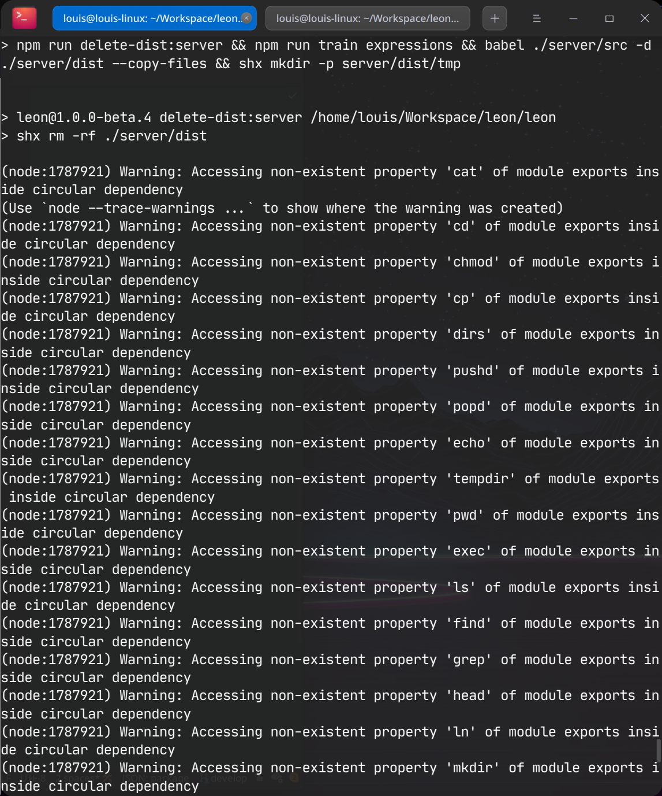

👋 Hey all, the time has come... Like **finally**! I know it has been a long time. The project has been paused for about 2 years. We'll talk about the reasons of this endless pause in another blog post.

Today, we'll focus on this new release and understand what's new and where the project is leading to.

## Main Focus

The focus of this release is quite obvious. 2 years pause on a project requires a deep work on:

1. Rethinking about the project vision.
2. Redefining who would be interested in the project.
3. Analyzing technical debt and taking action.

At least that's how I put it together.

It's important to mention that the work here was not only technical. I needed to refocus on the **WHY** of Leon.

- Why did I build Leon at the first place?
- What problems is it solving?
- Is it still valuable today?

Let's focus on the technical part as the other part will be covered in another blog post.

### Dependency Updates

That is what happens when you don't update your project dependencies for about 2 years... Let images speak for themselves.

#### After a `npm install`:

#### After a `npm run build`:

#### How The Commit History Looked Like...

I believe you got a rough idea of what needed to be done. Clearly I **updated all dependencies that Leon relies on**. Of course I could make use of tools such as [Dependabot](https://dependabot.com/) but I preferred to update everything manually. It allowed me to have a better control of what I was doing and see if each dependency still has its seat in the project. I read the changelog of each dependency to understand what has changed, has been improved and check if there was any breaking change.

#### Dropping Husky

Leon was using [Husky](https://typicode.github.io/husky/#/) that was triggering a script I wrote to parse a commit message on the `commit-msg` Git hook. It was working pretty well after the update, but GUIs like [GitKraken](https://www.gitkraken.com/) was not working properly anymore due to their recent changes (as it was working well before). So I decided to **drop Husky** or any Git hook trigger scripts because I don't want this be a bottleneck for contributors. So I keep it simple without commit restriction. I believe that the [CONTRIBUTING.md](https://github.com/leon-ai/leon/blob/develop/.github/CONTRIBUTING.md#commits) file is enough to understand how to commit to the project. However, it's quite important to respect the commit convention as it eases the changelog generation for each new release.

#### Dropping Babel?

With...

### Fix Hotword Detection

Based on Node.js... Using Snowboy... Need to find a better way in the future... Feel free to suggest some solutions.

## There is More...

### From CircleCI to GitHub Actions

...

### From Express.js to Fastify

Divlo...

...

### Try Leon with a Single-Click

...

### Force Minimum Node.js Version

...

### New NLP

...

### Docker Files Improvements

...

## Breaking Changes

- Haveibeenpwned package, need key now
- IBM voice...
- Remove Husky...
- Nearly none, see Trello cards

## What's Next

- Main goals: make drastic improvements on foundations/core and tooling; grow the community; be close to closed source assistant; rocketing modules...
- Blog post about the Coming Back and things I mentioned earlier.
- Rebranding + Full React. Like this new blog is based on Gatsby(link)
- CLI (kudos to Theo and Arthur. )
- You're welcome to contribute and join the new Discord
- Check the roadmap
