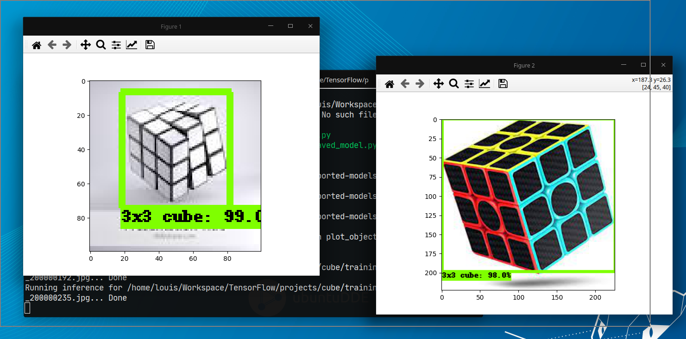
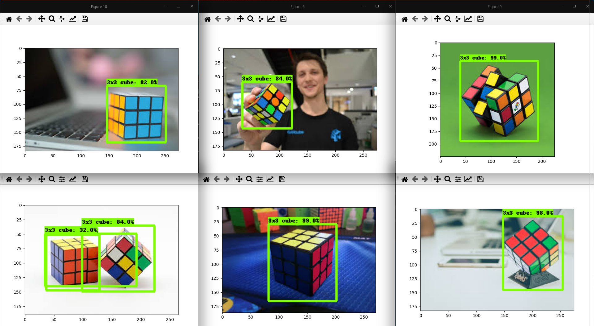
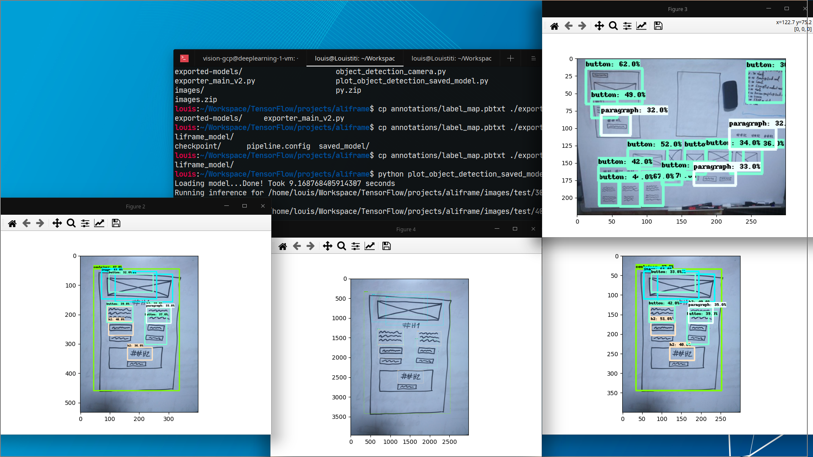
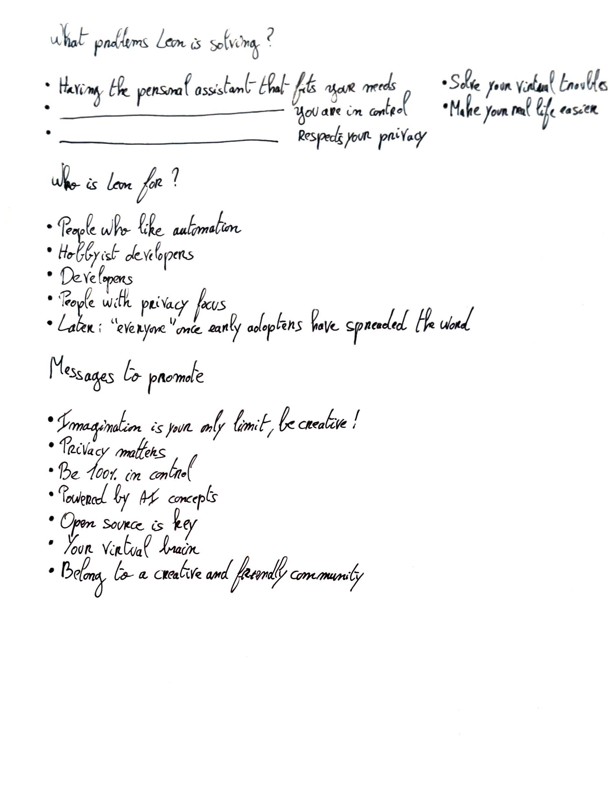
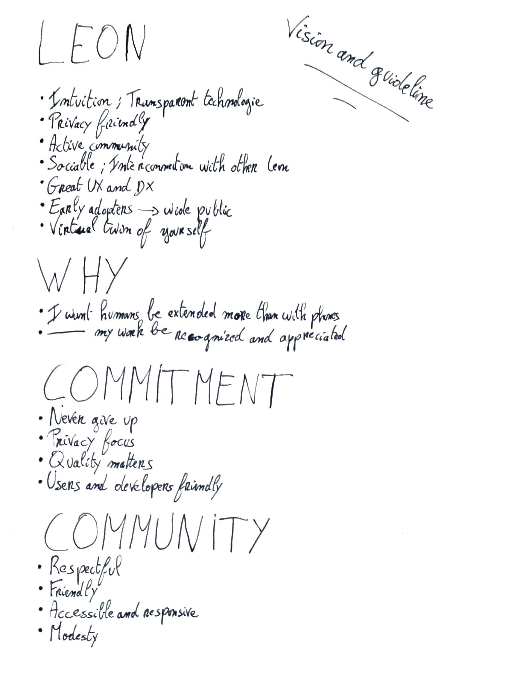

👋 Hey all, I mentioned in the previous blog posts that I'd share the reasons of my missing over the last few years, the vision I have for [Leon](https://github.com/leon-ai/leon), your open-source personal assistant, and more about what is going through my mind. So now is the time, let's get started!

### I Lost Focus

In June 2019 I released the second beta version of Leon. On that moment, I was in a dynamic mindset that I wanted to build anything I had in mind. It was not exclusive to Leon. I went to bed, keep thinking about solutions to solve problems I was facing in life.

I discovered the IoT world via my work on that time. It was fascinating. I love the whole concept of it. Building scalable architecture and most of all: pressing virtual or physical buttons to trigger actions that create physical impact on the other side of the globe.

Back in time, I created our own IoT pipeline using Microsoft Azure. I built the <abbr title="Public Key Infrastructure">PKI</abbr> to deliver and verify devices certificates. It was possible to control devices (send messages, invoke methods, etc.) from a web browser to the device. And it was also possible for devices to request the cloud and handle millions of connections thanks to the IoT hub and device provisioning service. All the data were handled via a stream analytics processor and landed into a data lake like CosmosDB and can also replicate important data to a PostgreSQL one if necessary. The main protocol between our cloud and devices was AMQP, but MQTT was also supported.

At that time, I wanted to build anything that was going through my mind, everyday. Well, we can say **I lost focus**. In such interesting and noisy world where there are infinite of possibilities, staying focus is maybe one of the hardest thing to do.

### My Missing

On top of that, I was questionning my career. I wanted to explore new horizons.

Also, having a girlfriend with an entrepreneurship mindset does not help. I wanted to show her real results. We all know how challenging it is to express what we are doing or share what we are able to do with someone who isn't in the tech industry.

So I got trapped into the **ego building** circle...

Here is a list of the major things I did during my missing and the benefits I got for each of them:

#### 2aud.io

I built a <abbr title="Software as a Service">SaaS</abbr> that converts URLs (web scraping), documents and text files into audio.

It was supporting 159 types of voice and 30 languages. I launched the private alpha version, collected feedback, got 230+ emails on the waiting list. Then I stopped for whatever reason.

What's cool here is I may inject the core of 2aud.io into a Leon module. So Leon could read any resource for us like a podcast.

<video controls="true" preload="auto" allowfullscreen="true" width="100%"><source src="/videos/2aud.io-preview.mp4" type="video/mp4"></video>

<video controls="true" preload="auto" allowfullscreen="true" width="100%"><source src="/videos/2aud.io-demo.mp4" type="video/mp4"></video>

**Benefits**: strengthen my A to Z building skill.

#### YouTube Videos + Community

I published web development videos on my [French YouTube channel](https://www.youtube.com/c/LouistitiFr), started a Node.js course by going in depth but with a language that everyone can understand, etc.

Around that I put together a community with a Discord server. Today there are still 670+ applications lining up...

In that community people started to build projects together to learn more about web development. I'd say 33% of the people where changing their career path to software engineering. It was composed of people with good experience and newcomers in the tech industry. This variety of profiles created interesting discussions.

People were sharing their projects progress during monthly calls we were organizing. We were warmly welcoming new fellows with proper calls too.

And we were working on our own projects during some immersive call sessions. The idea was to work during an hour in a row by muting microphones. Then we enabled back the mic to share our last hour progress and help each other if necessary for a few minutes. Then we kept going.

Stay tuned because **I'd love to recreate the same model of community but around Leon!** If you are interested in that then feel free to [subscribe to the newsletter](https://www.getrevue.co/profile/leon).

**Benefits**:

- Learned how to build a private and active community from the green grass.
- Learned video making and video animation.

#### Computer Vision

In December 2020, I challenged myself to learn a bit about computer vision within two days. To get started with this field that was new to me I trained a deep learning model that was recognizing rubik's cubes.

Then I created a <abbr title="Proof of Concept">PoC</abbr> that was recognizing shapes on a whiteboard in the purpose of generating a <abbr title="User Interface Description Language">UIDL</abbr> to automatically create web components.

Well, waaay more data were needed and my time was very limited so the model wasn't super accurate.

**Benefits**:

- Improved my learning skill.
- Today Leon has ears and mouth, why not add eyes later on? :)

Every benefit listed above will definitely help in my Leon journey.

In 2020 I also ran a French web agency with a friend on the side of my job and mainly worked on a streaming platform with a customer who is managing French celebrities. Then I started to create a mobile application with React Native to help a relative. Here too, my React Native experience will help Leon growth, I let you think of the possibilities... Hence, by coming back on Leon, I migrated nodes (docs from VuePress to Docusaurus; the website from Nuxt.js to Next.js and this blog from Hexo to Gatsby) to the React ecosystem.

I tried and learned many new things along the way. However, I knew my ultimate goal was to get back on track with Leon and make sure that I'm not missing anything I would like to explore more.

You know what my biggest fear is? It is to be on my death bed, look back and regret to not even try and accomplish my goals. Sooner I realized it is not by focusing on so many things like this that I'm gonna escape that fear.

Today I'm glad to say that I joined the Alibaba Group on the Lazada business several months ago. Don't worry, this does not mean I will have less time to work on Leon. Back in time, I was able to release the first beta version of Leon by having my full-time job. Organization is key.

### I Found Back my Whys

I needed to **refocus on the why** of Leon before to refocus on the technical part. Why am I creating Leon? Why did I even get started at the first place?

Here is how I see it: there is a **practical why**, and a **deep why**.

#### Practical Why

This why is specific to the project itself. What problems is Leon solving?

The answer of this why is the value/result of what the outside world will see and use. You can take a look at the [motivations here](https://docs.getleon.ai/#motivations). And you can continue to read to the next section to know more.

#### Deep Why

This one is a bit more personal. It is my source of energy to solve the practical why. It is the fuel of my practical why.

To answer, I'd say:

- I like solving problems, but most importantly the "how" I solve them is what makes me move forward. This is not specific to programming. It also requires talking with people, doing some so-called "marketing", designing, overall thinking, and more.
- Sharing your creations with the world is so exciting because you can let your blueprint behind you. The tech industry is very pleasant for that: you face an issue, you think of a way to solve it, then you can "quickly" build something to fix it and share it.
- Having my own vision and driving towards the direction that I have chosen allows me to discover and learn new fields.

### Vision for Leon

Earlier this year I questionned myself to get back on track:

What I dream of for Leon is that we can interact with him via different clients (mobile, desktop, customized hardware, etc.). Today with the growth of voice and <abbr title="Natural Language Processing">NLP</abbr> technologies, it becomes way more accessible to create powerful personal/virtual assistant.

With my IoT experience, I will also bring this field to Leon so we can do home automation and more.

I'd like to bring a social aspect too. At the moment I prefer not to disclose this part.

We can even imagine of using AR and/or VR, but that is a long term thing.

The whole idea is that Leon becomes your virtual brain so he can handle all your virtual troubles and makes you feel that the technology disappears somehow.

#### Focus

To do so, here are the big lines:

1. The **core of Leon needs to be more powerful**. So I will be focusing on this part from now on. Like a way to easily support multi languages, create widgets, add support of JavaScript modules, etc. Check the [roadmap](http://roadmap.getleon.ai/) to see more.
2. Leon needs to **cover most of the basic use cases of existing closed source assistants**.
3. **Growing the community**. I paused the project for too long. And without an active community, Leon cannot grow fast. I want to put together a special community of creative people like I mentioned earlier in this post.
4. I have some ideas in mind that will **make Leon smarter**. But I will keep those in the private roadmap at the moment and disclose them when the time comes.

Along with the vision, a rebranding was necessary to have a atmosphere that aligns with the vision of Leon. You can take a look at a [preview of the new landing page here](https://getleon-ai.vercel.app/). In a next blog post I'll talk more about this rebranding. Explaining the reasons behind the "outter space" atmosphere and more...

### Wrap Up

With all that said, the direction of Leon is quite clear. **I've been missing working on Leon so much!** Today we can start again and move forward in a healthy way. Also, I'd like to use this moment to thanks all the [sponsors](https://github.com/leon-ai/leon#-sponsors) and [Vercel](https://vercel.com/?utm_source=leon-ai&utm_campaign=oss) for recently sponsoring Leon 🖤 

It feels good to be back!

I recently opened my GitHub Sponsor so you can now [sponsor me on GitHub](http://sponsor.getleon.ai/) and get some perks.
