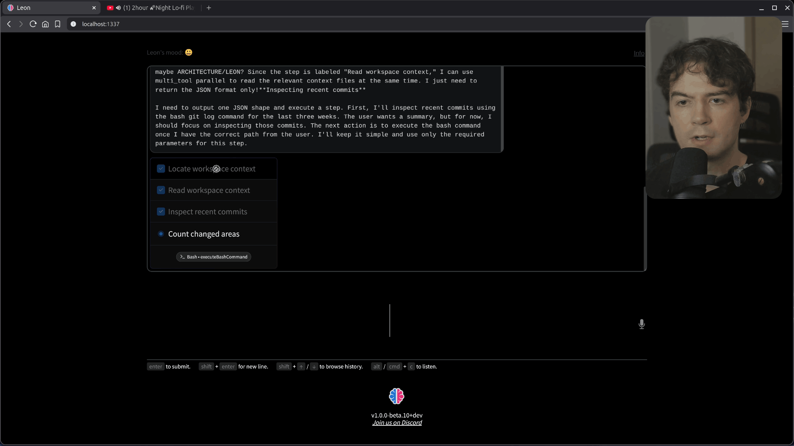

👋 Hello everyone! Over the last (few years), and especially the last three weeks, I've been making major progress on Leon AI, and I wanted to share where things stand today, what has improved, and where the project is heading next.

There has been a lot happening behind the scenes. If you look at the recent [Git history](https://github.com/leon-ai/leon/commits/develop/), the amount of change is actually pretty massive, and I'm honestly very happy with how things are evolving. This phase has been deeply focused on Leon's brain: memory, context, self-awareness, proactivity, model stability, and the overall agentic loop.

In this blog post, I'll walk you through the most important updates and explain why they matter for the future of Leon.

Feel free to [watch the YouTube video](https://www.youtube.com/watch?v=_iau01xniqA) in case you prefer watching.

## What's New

### Memory, Context and Self-Awareness

```txt
context/
└── private/
    ├── .leon-private-self-model.json
    ├── .leon-pulse-state.json
    ├── LEON_PRIVATE_DIARY.md
    ├── PULSE.md
    ├── .activity-state.json
    ├── .gitkeep
    ├── .habits-state.json
    ├── .local-ecosystem-state.json
    ├── .local-inventory-state.json
    ├── .media-profile-state.json
    ├── .owner-profile.json
    ├── .persona-weather-cache.json
    ├── .react-execution-continuation-state.json
    ├── .react-history-compaction-state.json
    ├── .workspace-intelligence-state.json
    ├── ACTIVITY.md
    ├── ARCHITECTURE.md
    ├── BROWSER_HISTORY.md
    ├── GPU_COMPUTE.md
    ├── HABITS.md
    ├── HOME.md
    ├── HOST_SYSTEM.md
    ├── LEON.md
    ├── LEON_RUNTIME.md
    ├── LOCAL_INVENTORY.md
    ├── MEDIA_PROFILE.md
    ├── NETWORK_ECOSYSTEM.md
    ├── OWNER.md
    ├── STORAGE.md
    ├── SYSTEM_RESOURCES.md
    └── WORKSPACE_INTELLIGENCE.md
```

```txt
memory/
├── archive/
├── daily/
├── discussion/
│   ├── 2026-02-28.md
│   ├── [..]
│   └── 2026-03-16.md
├── persistent/
│   └── 2026/
│       ├── 02/
│       └── 03/
├── reports/
├── .gitkeep
├── index.sqlite
├── index.sqlite-shm
└── index.sqlite-wal
```

One of the biggest areas of work has been Leon's memory system. I really wanted Leon to have a more advanced and useful memory, not just something superficial.

Now, the more you talk to Leon, the more Leon can learn about facts, past events, and your preferences. It can understand how you like to work, what matters to you, and what happened previously in your interactions. After each conversation turn, Leon saves memory fragments into its own database so they can be retrieved later.

The goal is simple: if something happened weeks or months ago, Leon should be able to remember it and help you continue from there naturally.

What makes this memory system powerful is that it doesn't rely on a single retrieval method. Leon uses:

- full-text search,
- RAG-style retrieval,
- vector embeddings,
- a SQLite database,
- and markdown-based memory files.

In other words, the memory is split into two parts, and Leon can use both depending on what it needs. This gives much better recall and makes the whole system more flexible.

I'm pretty happy with the result so far because, from my testing over the last few weeks, the memory system already feels very advanced.

### A More Context-Aware Leon



Context is just as important as memory.

If the owner allows it, Leon can understand a lot more about the environment it runs in: the computer setup, habits, software usage, activity patterns, and other useful contextual signals. All of this helps Leon become more self-aware and more relevant in how it responds and acts.

At the same time, I wanted to avoid filling the context window with too much noise. If you dump everything into the model at once, you waste tokens and increase the risk of hallucinations.

So I implemented a progressive context mechanism.

Tools in Leon belong to toolkits, and depending on the toolkit being used, Leon injects only the relevant context on the fly. For example, if a tool belongs to the operating system toolkit, Leon can automatically add environment-specific details such as runtime information, workspace context, Node.js or Python versions, and more, only when needed.

This approach keeps the context window cleaner, more efficient, and more useful.

### Leon's Private Diary and Proactive Behavior

Another major improvement is Leon's introspection system.

Leon now has its own private diary. When Leon takes actions or talks with you, it can reflect on what happened, record observations, and keep track of whether certain actions were useful, questionable, or worth revisiting.

This is an important part of making Leon feel more agentic.

Over time, Leon can use these reflections to become more proactive. Instead of only waiting for instructions, Leon can notice patterns, revisit pending tasks, and decide to help on its own when it makes sense.

I also worked a lot on what I call the pulse mechanism. On a regular basis, Leon can inspect its pending tasks and internal reflections, then decide whether it should do something useful by itself.

This is one of the core pieces behind Leon becoming more than just a reactive assistant.

### Better Stability Across Model Providers

Of course, all of this depends on large language models, so I spent a lot of time improving Leon's stability across providers.

Leon supports multiple providers such as OpenAI, OpenRouter, Anthropic, and other OpenAI-compatible APIs. In theory, many providers follow a similar standard, but in practice there are always differences.

Some providers behave differently around reasoning modes, thinking configuration, compatibility details, or feature support. These small differences matter a lot when you're building a reliable agentic loop.

So a good part of my recent work was about handling those edge cases cleanly and making Leon more robust regardless of which provider is being used.

### Local LLM Support with Llama.cpp

Another important milestone is local model support.

Over the last couple of days, I worked on the Llama.cpp implementation so Leon can also run with a local large language model instead of depending entirely on third-party services.

That means if your hardware is powerful enough, you can run Leon locally with your own model. This is a big step for privacy, flexibility, and ownership.

I first started with Ollama for the local mechanism, but I ultimately preferred to move toward Llama.cpp for this implementation.

This is still an area I'm actively refining, especially around stability and provider switching, but the progress is very encouraging.

### Hooks and Smarter Tool Output Handling

```json
"hooks": {  
  "post_execution": {  
    "response_jq": "[.result.segments[].text] | map(select(type == \"string\" and length > 0)) | join(\" \")"  
  }  
}
```

I also introduced a mechanism called hooks.

Each tool in Leon now has its own lifecycle, with logic that can run before execution, during execution, and after execution. This opens the door to much more intelligent orchestration.

For example, sometimes a tool returns a full JSON structure, but the LLM only needs a specific property from that output. Sending the whole JSON wastes tokens and adds unnecessary noise.

With hooks, I implemented a way to transform tool results more efficiently, including support for extracting only what matters from structured output. This makes the system leaner and improves the overall flow inside the agentic loop.

### Mood and Persona and Turn Metrics

Leon is not only becoming more capable, but also more expressive.

Leon has its own mood and persona, and these can evolve depending on different criteria. For example, the weather, the day, or other contextual signals can influence Leon's mood.

I also improved live feedback around tool execution and turn-level metrics. Leon can now expose more of what it is doing, how fast a turn is running, and how expensive it is in terms of inference behavior.

I think this is important because good agents should not feel like black boxes.

## Where We Are Heading

At this point, I think the changes are significant enough that Leon is heading toward a new major version: **Leon 2.0**.

The first beta of Leon was released back in 2019. So long ago!
But with all the breaking changes, the major new features, and especially the new agentic architecture, it really feels like Leon is entering a new era.

My plan is to move toward a **developer preview** once this new version reaches a good enough level of completion.

### Desktop Installer and Smoother Onboarding

Another major focus will be the installation and onboarding experience.

I want installing Leon to feel smooth and welcoming. Instead of making people type too many commands in a terminal, I want a more polished desktop installer experience with binaries and visuals.

I also want the onboarding flow to feel more cozy and more alive.

For example, with the owner's permission, Leon could play music during onboarding and create a more pleasant first-time experience. This may sound like a small detail, but I think these details matter a lot when building a personal AI that is meant to live with you on your computer.

And of course, because Leon's awareness of your environment depends on trust, onboarding is also the right moment to ask for permission clearly and transparently.

## Looking Ahead

Right now, I'm mostly working on Leon's brain: building the 2.0 version of Leon's intelligence from the inside out.

What we have today is already exciting, but I believe what is coming next will be on another level entirely.

Leon started years ago, and even back in 2019 the project had already reached the front page of Hacker News twice. At the time, open-source AI assistants like this were far less common, and Leon was already pushing in that direction with a solid NLP foundation.

Now, with everything I've learned since then about personal AI, memory systems, environment awareness, and agentic behavior, I can say with confidence that what Leon is becoming is going to be very massive.

I'm really looking forward to sharing more visual updates soon.

## Stay Tuned

There is still a lot to polish, but the direction is clear.

Leon is becoming more aware, more proactive, more personal, and more capable of working with you over time instead of just replying turn by turn. That has always been the bigger vision behind the project.

Thanks everyone for following the journey so far. I really hope you'll stick with Leon and stay tuned for what comes next.
