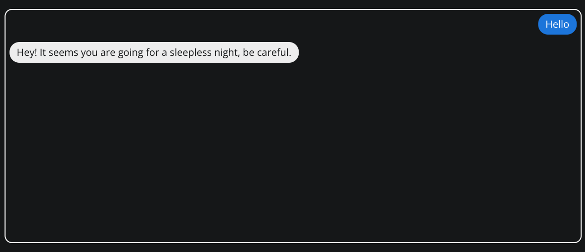

👋 Hey all, the first release of the [Leon CLI](https://github.com/leon-ai/leon-cli) has landed a few days ago. I'd like to let [Divlo](https://github.com/Divlo) and [Arthur](https://github.com/ArthurDelamare) share their experience building it, the problems they faced, how they solved them and whatever they would like to share with you!

If you are not familiar with Leon yet, Leon is an open-source personal assistant. He is based on Node.js for the core, and uses Python for his modules (skills). Therefore, several requirements need to be installed to start to fully enjoy the experience.

Installing these requirements can be a hassle, origins of several issues you reported were due to their setup. Knowing that we all come from different backgrounds, it may be troublesome to get through this. So we have thought of a CLI to get your own Leon running in 3 commands.

### How the Project is Organized

The two companions (us, [Divlo](https://github.com/Divlo) & [Arthur](https://github.com/ArthurDelamare)) started working together with common goals:

- Make the installation easy
- Cross-platform
- And the most important of all, do it well

You guess it, many discussions were needed to have a proper plan (come and join us on the [discord server](https://discord.gg/MNQqqKg), it's kinda cool there).

Split the tasks, a system to maintain good quality, creating automation, manage our time... So many choices and only one pair of brains.

Once upon a time a brainstorm, a really sweaty one!

How many features should we release? The minimum, we would not want to confuse our friendly Leon users with unnecessary steps.

Even with a few features, we had our whole package of difficulties. Fortunately, we had a well-structured task management system:

- [Trello](https://trello.com/b/7bdwhnLr/leon-your-open-source-personal-assistant-roadmap) for the roadmap.
- Discord to communicate, do pair-programming and communicate with the community.
- [GitHub](https://github.com/leon-ai/leon-cli) to host our dear open-source CLI and discuss about implementation inside Pull Requests.

### Tech Stack

You asked for the tech stack? This one is tricky...

From the beginning, the very first idea that emerged was to develop the CLI with JavaScript using Node.js to allow as many people as possible to contribute. For maintaining purpose and also personal preferences, our heart led us to TypeScript. You could argue with that choice but try it, you'll be convinced in no time 😉

The next decision was the main library to build the CLI. A classic would be [Commander](https://github.com/tj/commander.js) but it had a big drawback for us: the structure. Our goal was to start small and progressively tend to a full-featured tool, the companion for our Leon journey. Commander would allow a nice start but leads us to a kind of messy project as most of the command parameters are inside a single file.

Let us introduce another alternative: [Clipanion](https://github.com/arcanis/clipanion), a type-safe CLI library with no runtime dependencies, made with TypeScript.

A special thanks to [Sindresorhus](https://github.com/sindresorhus). Many of our struggles have been solved by his numerous packages, including:

- `execa` to execute commands.
- `chalk` for the tasty flavour in your command line interface (it adds color).
- `conf` to let the CLI persists some data (configuration files and logs).

### Technical Challenges

We offer two ways to install Leon:

1. A classic installation (directly installed on your machine).
2. With Docker (an independent container).

Two options and two brains, a perfect match! Naturally, we divided the work:

- Divlo started on the Docker install.
- And Arthur the classic one.

Let's dive into some experience feedback:

**Divlo**: The command `leon create birth` was the hardest command to get it working as it's completely cross-platform, so we needed to create Virtual Machines to test on multiple OSes. The Docker installation was a little bit easier, as Docker does the "heavy lifting" for us.
We both learned a lot building this first version of the CLI, but it's only the beginning and we want to make it more and more useful to be the companion for your Leon journey.

**Arthur**: Leon's CLI is a proof that nothing beats a challenge to learn and exceed your skills. I probably lost some hair managing the cross-platform side... So, I hope the community will appreciate my dedication.
Jokes aside, it's one of the most interesting project I worked on. Enjoy using it!

#### Scalability

How to easily add features without breaking existing ones? With a stable and trusted architecture.

We started to talk about it before: Clipanion. But it's not the answer to everything... We also needed to reuse features between commands. The object-oriented architecture and the services to isolate our functions per domains were a part of the answer.

To adapt to everyone and every architecture, each command has its set of options.

The next step for scalability is the testing system! For this v1, supporting Windows, Linux and macOS was the biggest challenge in terms of testing and scalability, by far.

#### Testing

We used a common strategy, a combination of unit testing and end-to-end testing. Knowing that the specificity of our project is to have the OS as the kernel, the end-to-end tests are the most important, they are the guardian of our stability.

Scenarios are the same on each OS and are executed on independent machines:

1. Retrieve the CLI
2. Make Leon alive by getting all its dependencies using `leon create birth` command

   

3. Start Leon with `leon start` and verify that the interface is available

   

To ensure that the code remains at the top quality and that new features never breaks older ones, we implemented Continuous Integration. It means that every time we (or you) push new lines of code to the CLI, all the tests are executed through GitHub Actions.

### What to Expect in the Future

A lot of stuff is coming, our ideas never end. Not only our ideas, yours too. 🙂
Feel free to post any idea you have [here](https://github.com/leon-ai/leon-cli/issues).

A non-exhaustive list of incoming features:

- `leon info` to get information of our Leon instances
- `leon update` to obviously update Leon and see him evolve (get the latest features)
- A better developer experience for the creation of modules / packages
- Easily modify the configuration of Leon (text-to-speech, speech-to-text...)
