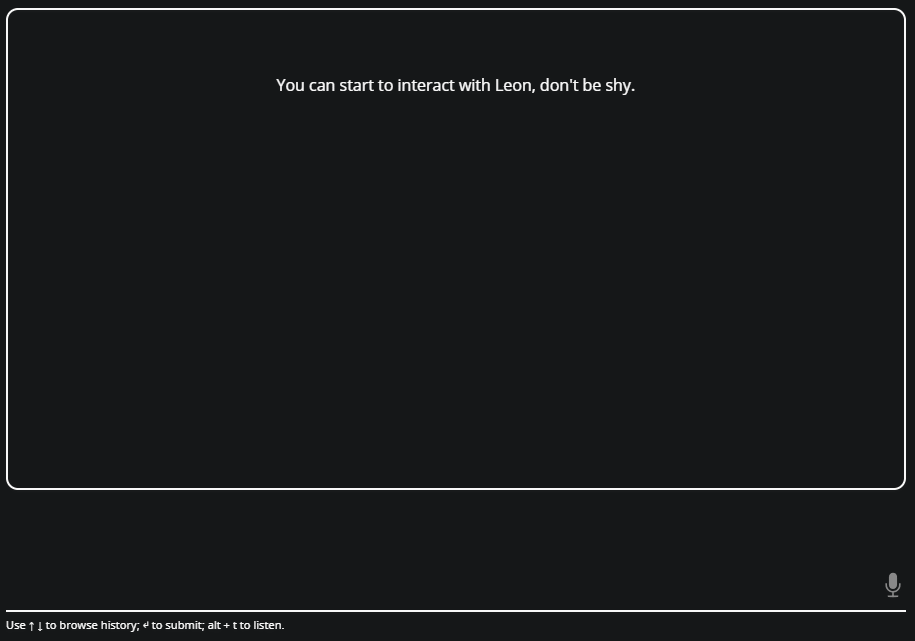

👋 Hey all, the `1.0.0-beta.2` release has been shipped!

Before we dive into it together, let me thank you for all of your support over the last few weeks. I received interesting feedback for the next of Leon.

That said, let's get started.

## What is This Release For

The main purpose of the `1.0.0-beta.2` release was to allow us to create more advanced/detailed modules by improving the NLU (*Natural Language Understanding*).

It has been possible thanks to the great [NLP.js library](<https://github.com/axa-group/nlp.js>).

## What Does it Contain

### NLU Improvement

It introduces query object and entities to improve NLU for more detailed queries. The docs [has been updated](<https://docs.getleon.ai/packages-modules.html#query-object-entities>).

Basically, it is now possible to make such detailed queries:

```
Leon, give me the 4 GitHub trends of this week for the JavaScript language.
```

Or

```
Leon, what were the four first Product Hunt trends on the 7th of October 2018?
```

### New Trend Package

This new package contains two modules today. I decided to create them to validate the NLU improvement. Pictures will explain more than my words:



### Allowing HTML Output in The Answers

As you might noticed in the GIF above, it is now possible to [use HTML](<https://docs.getleon.ai/packages-modules.html#html>) for a better rendering on the client.

### Docker Installation Bugfix

When a `.env` file was already existing while Leon was getting installed with Docker, Leon was saying that he had errors with some of his modules when we were trying to talk to him.

It has been fixed.

### Docs Improvement

- New [Installing Third Party Python Packages](<https://docs.getleon.ai/packages-modules.html#installing-third-party-python-packages>) section.
- New [Query Object & Entities](https://docs.getleon.ai/packages-modules.html#query-object-entities) section.

### Others

And other stuffs that you can find in the [changelog](<http://changelog.getleon.ai>).

## What's Next

I'm considering to allocate more time on Leon besides my full-time job. I've got plenty of new plans and several opportunities appeared.

### `1.0.0-beta.3`

In the meantime, here are the most important milestones for the `1.0.0-beta.3`:

- [Named Entity Recognition](<https://github.com/leon-ai/leon/issues/62>).
- Something that I have dreamt about (true fact) in the night between the 22nd to the 23rd of February 2019: [Slot Filling](<https://github.com/leon-ai/leon/issues/61>).
- [Context](<https://github.com/leon-ai/leon/issues/81>).
- And probably more, such as some modules to confirm the features above.

Do not hesitate to take a look at [the roadmap](<http://roadmap.getleon.ai>) to follow the progress of the project.
