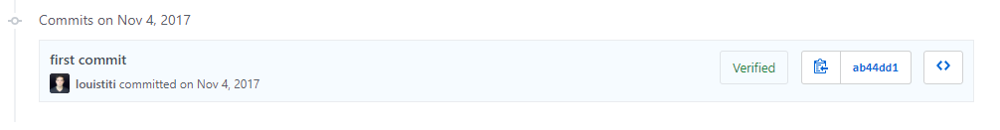
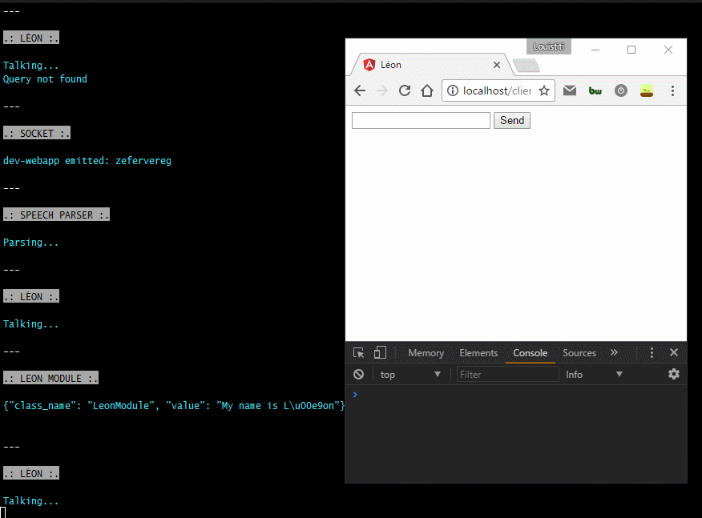
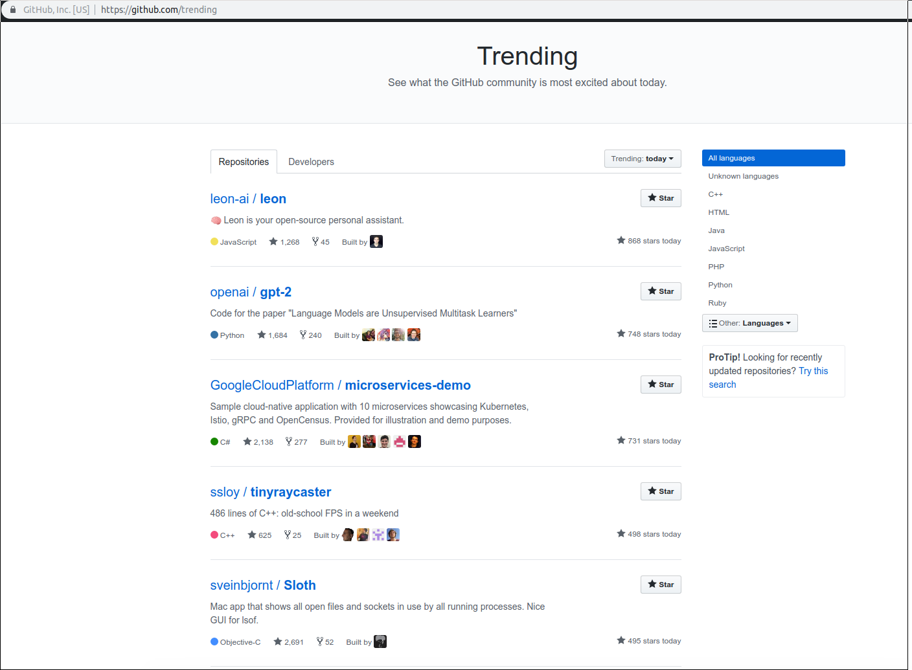
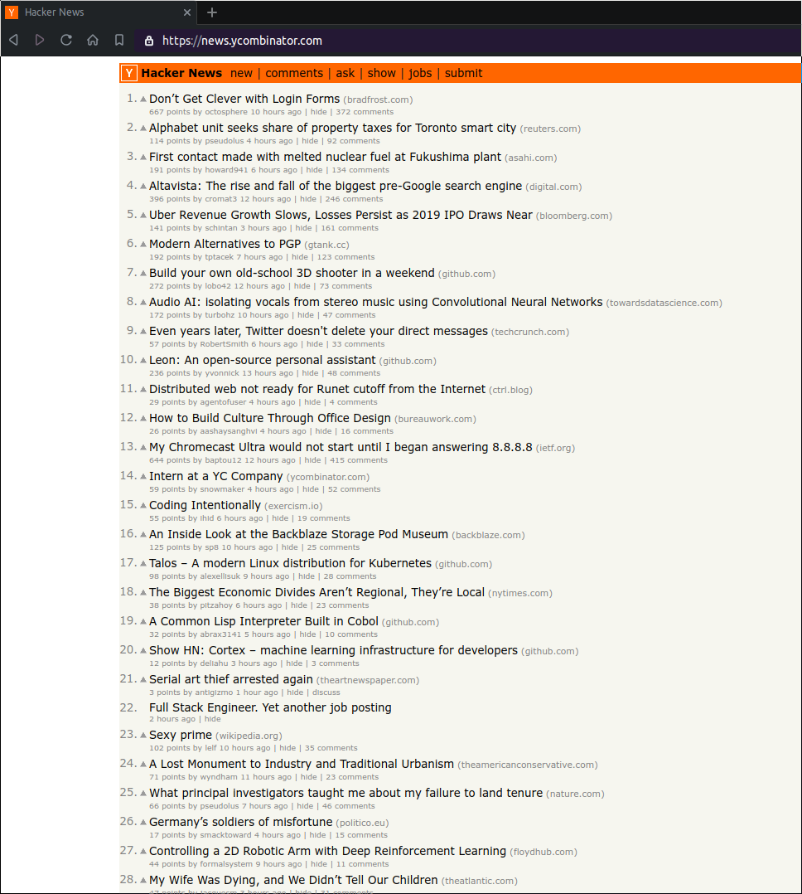

**Big disclosure**: I never watched the movie *Léon: The Professional* (at least not yet).

## Who Am I

👋 Hey all, my name is [Louis Grenard](https://twitter.com/louistiti_fr), I was born in the '90s in the French mountains. I'm currently living in Shenzhen, China and working at a great company called [NOA Labs](https://www.noa-labs.com).

I love building things (I have since I was young), solving my GAN356 Air SM and I truly believe in [open source](https://github.com/louistiti).

## Who is Leon

Let me explain in a few words.

Leon is an open-source personal assistant who can live on your server. He does stuff when you ask for it.

You can talk to him and he can talk to you. Also, you can text him and he can text you. If you want to, Leon can communicate with you while offline to protect your privacy.

## Why The Hell "Leon"

*Leon* is pretty simple to remember as a name and it is easy to pronounce in any language (*Leon* in English, *Léon* in French, *Lái áng* in Chinese, *León* in Spanish, etc.). Moreover, *Leon* comes from *Leo* which means *lion*, which is my astrological sign.

## Timeline

**End of 2016** *—* Let's go back to the end of 2016. Mark Zuckerberg, the Facebook CEO published [a note](https://www.facebook.com/notes/mark-zuckerberg/building-jarvis/10154361492931634/) and [a video](https://www.facebook.com/zuck/videos/10103351034741311/) about his 2016 personal challenge. I was very excited about the idea of interacting with a tech system by voice. Of course virtual assistants such as Siri already existed at that time, but the fact of reading about and seeing the Zuck's assistant made me want to know more about it.

A few days later I was on a train on my way back to my dear hometown in France. I grabbed my laptop and started coding a proof of concept in an HTML file. My initial motivation was to understand how speech-to-text and text-to-speech were working in web development, so I implemented the [Web Speech API](https://developer.mozilla.org/en-US/docs/Web/API/Web_Speech_API) and a few hours later I got my PoC done.

**Early 2017** *—* A few months later I was on my way to attend a family event in Munich, Germany and I was thinking about doing more than a simple web speech PoC - I wanted to create something that could help in my daily life. I remember the first feature idea was to create a *financial tracker*, I was thinking it could be so cool to say:

```
Leon, how much money did I spend in restaurants in 2016
```

And have something that replied with a few details over voice and text. So I got my phone and started to write some feature ideas.

**Mid-2017** *—* At the end of June 2017 I moved to China and began my full-time job here. After some time, I decided in October to make a plan to work on Leon in a more dedicated way. I committed to a private repository on the 4th of November 2017.



A few weeks later I was thinking if Leon helps me, then it might also help others. So I decided to create a modular architecture, including one module to download videos from YouTube and save them on the device. I wanted that module because at that moment I was living an hour from my work via subway and I wanted to watch/listen to tech videos/podcasts during my transit time.

**Early 2018** *—* On the 7th of January 2018 I created [Leon's roadmap](https://roadmap.getleon.ai) by setting up some cards such as [this one](https://trello.com/c/wt8W83AV/85-%F0%9F%93%9D-open-source) and started to inform myself about open-source ecosystems *(I highly recommend you [Open Source Guides](https://opensource.guide/))*. At that time, this is what Leon looked like:



**March 2018** *—* Personal problems reared their head and I did not work on Leon for two months. After this period, in March 2018, I wanted to test if Leon is interesting not only for me, but also for others. So I informed myself about Reddit - how it exactly works, the rules, etc. And I ended up creating a teaser video and publishing it to several subreddits, such as [/r/Python](https://www.reddit.com/r/Python/comments/85axig/im_building_l%C3%A9on_an_opensource_personal_assistant/), [/r/javascript](https://www.reddit.com/r/javascript/comments/85aso8/teasing_im_building_l%C3%A9on_an_opensource_personal/), etc. I received tons of feedback. There was so many views on the teaser video that it exceeded the view limit on Google Drive, so I needed to quickly publish the [video to YouTube](https://www.youtube.com/watch?v=1B7JMBPZ0qI). At that moment, Leon was still using the Web Speech API, so I refactored by implementing things that you know with the first release.

**Mid-2018 - now** *—* In August 2018, I decided to take a break due to other personal problems. Then from November 2018 onwards, I worked on Leon, culminating in the release 🎉.

If I calculate the total time I worked on the Leon's `1.0.0-beta.0` release, the result is **11 months**, including weekends, early mornings during weekdays (between 6am to 8am) before my lovely day job and also evenings after going to the gym. And of course this result also includes days away from the computer. This number represents the whole timeline and not the specific time I was purely working on Leon. The number of commits on the private repository is 438.

## Thanks

I'd like to interrupt the story here to show my thanks because I think it's fitting after the last section.

I extend warm thanks to my:

- Family for supporting my long speeches about Leon and accepting my absence from some family events.
- Lovely girlfriend for giving me such energy and motivation.
- Friends who suggested ideas and believed in Leon since his early days.

💙

## One Week Later

I released Leon under the `1.0.0-beta.0` version on the 10th of February 2019. At the time of writing, we are at the one week mark after the release. Let me share what's happened over this week but before that, please... let me tell you that you are incredibly **A.W.E.S.O.M.E!**

Leon has been warmly welcomed and this proves Leon has potential and there is a lot to do, **together**. My friends, an amazing adventure starts here!

Here are some numbers from the initial release:

1. **24 hours later** *—* Leon gets his first 100 GitHub stars and appears in the GitHub JavaScript trending page.
2. **48 hours later** *—* Leon reaches 200 GitHub stars.
3. **4 days later** *—* Leon has more than 400 GitHub stars.
4. **5 days later** *—* Someone published Leon on the well known Hacker News and it has been well received. Leon reaches the front page in the 3rd position for few hours, and then the 10th position for a full day.
5. **6 days later** *—* Leon's repository is ranked at the 1st position of the main GitHub trending page.
6. **7 days later (today)** *—* Leon has more than 1.7k stars.





## What's Next

The numbers above are promising. This is great and thanks to all of you for supporting the project. However, there is a lot [upcoming](https://roadmap.getleon.ai), this first release is only the foundation of Leon.

I already set the [next milestone](https://github.com/leon-ai/leon/milestone/1), the `1.0.0-beta.1` version. Now, Leon needs to grow up, he is only one week old. I count on you to help by [contributing](https://github.com/leon-ai/leon/blob/develop/.github/CONTRIBUTING.md).

**Let's educate and build Leon together**.
