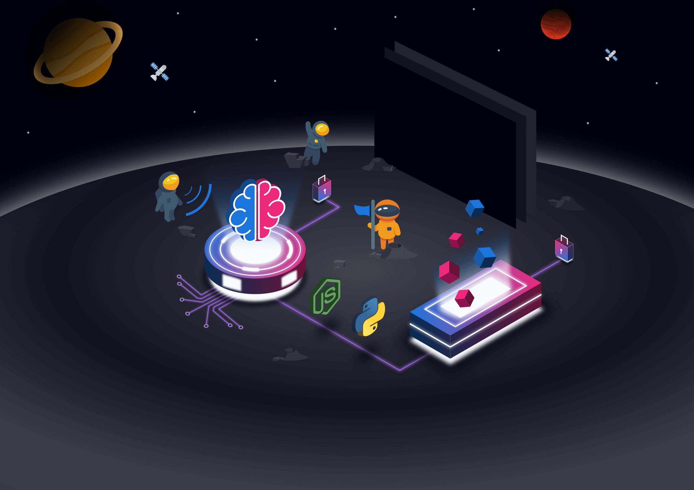
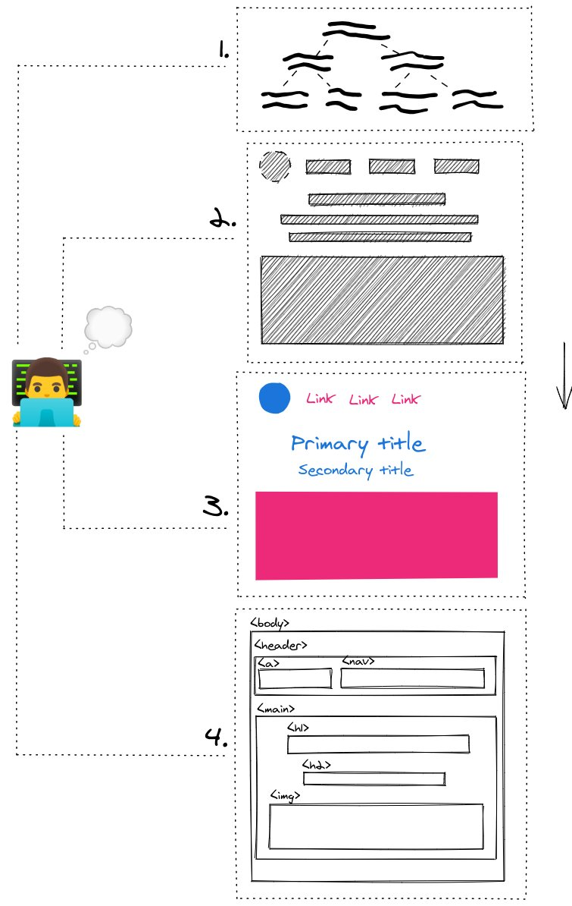
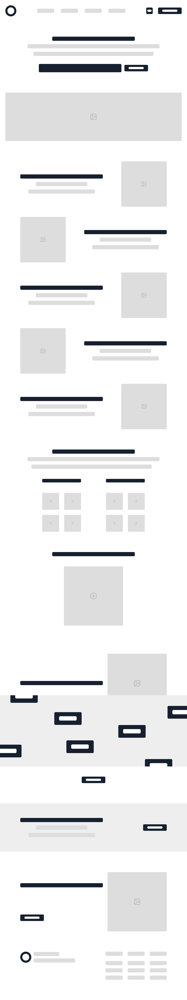

👋 Hey all, here is a summary of what happened on Leon over the month of May 2021.

Usually most of the work related to Leon happens on the [main repository](https://github.com/leon-ai/leon). However, there is a beginning of an ecosystem on Leon, so there is also work happening outside of this repository.

We are mostly focusing on **the rebranding** and thanks to [Divlo](https://github.com/Divlo) and [Arthur](https://github.com/ArthurDelamare) we can also focus on the **CLI** in parallel which they'll tell you more in this blog post.

## The Rebranding



The rebranding has started. Indeed, the project has paused for about 2 years, so I feel it is necessary to give a fresher look to Leon and the sub projects.

Besides the fresher look, I noticed that a lot of open-source projects don't really invest time and energy on the overall appearance. I totally understand that as it might not be the most important priority, but I want to make it different with Leon. I want to make it a priority. The same goes with the user experience.

I wish Leon reflects the vision, the whys I started Leon at the first place, what can inspires people, myself, and so on.

Other than writing code, I also enjoy working on user interfaces, designs and all things related to colors, shades and shapes! So why not use it?

With all that said, I picked up the main theme for Leon, which will be the **outer space**. There are a few reasons behind that, but we'll dig into that in another blog post once the rebranding will be more advanced. Actually you can have an overview with [this roadmap card](https://trello.com/c/Y5GH6162/322-%F0%9F%93%9D-100-beta5-think-of-visual-identity-design).

At the moment, I'm working on a few assets such as the one above which will be implemented on the landing page of getleon.ai.

Here is how I like to put things together before creating a new web page:



1. **Create a content tree**: help to define my content in a sequential order.
2. **Draw the wireframe**: help to position my content.
3. **Design the sketch**: help to anticipate the final representation.
4. **Code**: this one is obvious 😊

I finished to define the content that will be displayed on the landing page. You can find the content tree on [this roadmap card](https://trello.com/c/6iMZFB6E/324-%E2%9C%A8-rebuild-getleonai-landing-page).

The wireframe has also been drawn:



Along with the assets, I'm working on sketching the new landing page.

If you wonder what design-related tools I use, please find my toolkit below:

- [Inkscape](https://inkscape.org/): to work on assets that requires isomorphic/3D look. It is easy to get started with, user friendly and open source. What can you ask more?
- [Excalidraw](https://excalidraw.com/): to create schema with a drawing look. Such as the one I made to explain my process before creating a web page.
- [Figma](https://figma.com/): to design user interfaces, wireframes or prototypes. Until now I was using [Sketch](https://sketch.com/), but I feel Figma makes it easier to share with the outside world.
- [SVGOMG](https://jakearchibald.github.io/svgomg/): to optimize or clean up SVGs. Especially useful before animating SVGs.
- Regarding animations, I mostly make use of CSS animations but I might also use [Rive](https://rive.app/), [LottieFiles](https://lottiefiles.com/) or a similar tool. If you have a go-to to animate SVGs, please drop an email at <louis.grenard@gmail.com> 😉

## Road to React

The migration towards the React ecosystem has also began.

I'll be using React more and more on work-related projects. So I feel it can be a good move to migrate most of the front-end nodes of Leon to React.

Moreover, I love the functional approach that React brings. The large ecosystem and community are also a very attracted point.

So, that's why this blog has moved from [Hexo](https://hexo.io/) to [Gatsby](https://www.gatsbyjs.com/) and the docs has moved from [VuePress](https://vuepress.vuejs.org/) to [Docusaurus](http://docusaurus.io/)!

The upcoming landing page will benefit from [Next.js](https://nextjs.org/).

Once it'll be time to focus on the client mobile app, then I'll probably go for [React Native](https://reactnative.dev/).

## Dependabot

In the [previous blog post](https://blog.getleon.ai/getting-rid-of-dust-1-0-0-beta-4/) I talked about the noise caused by Dependabot. Then I received several good feedback about the grouping feature of Dependabot. Unfortunately, at the time I'm writing this article, Dependabot does not support 1 pull request for multiple dependencies updates.

But still, I decided to go deeper with Dependabot and give it a try.

So I installed it on the main, blog and docs repositories. I scheduled a weekly check on Friday at 22:00 UTC. 

In that way I can spend a few minutes to review these 3 repos once a week and safely update the dependencies.

```yaml
version: 2
updates:
  - package-ecosystem: 'npm'
    directory: '/'
    schedule:
      interval: 'weekly'
      day: 'friday'
      time: '22:00'
    commit-message:
      prefix: 'chore'
      include: 'scope'
    reviewers:
      - 'louistiti'
```

## GPT or BERT in Leon?

...

## The Progress on the CLI

...

## Got a New Job

...
