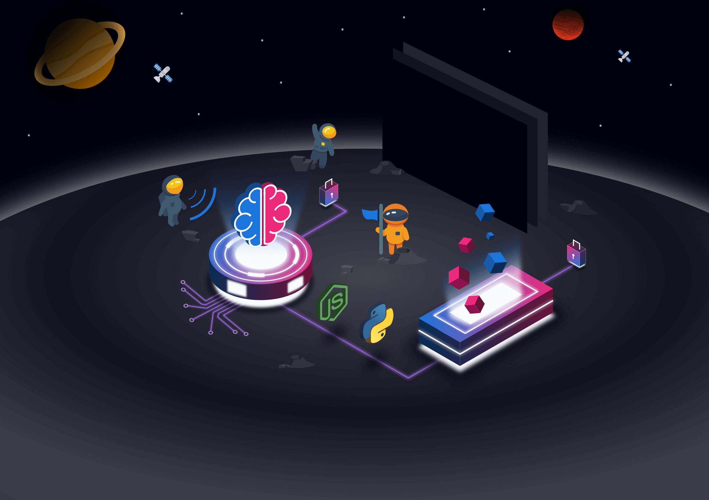
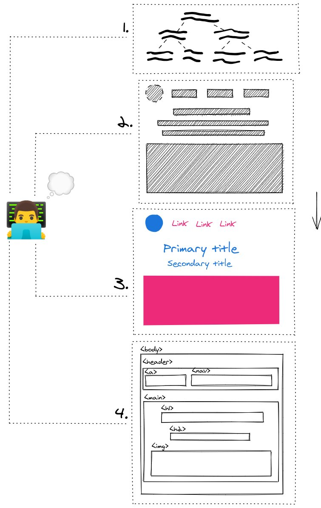
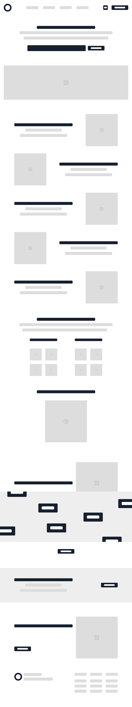
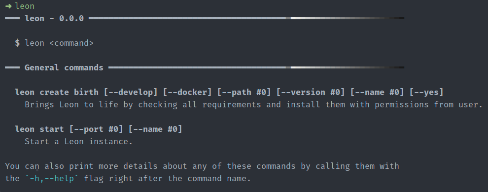
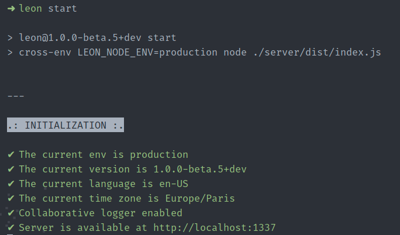

👋 Hey all, here is a summary of what happened on Leon over the month of May 2021.

Usually most of the work related to Leon happens on the [main repository](https://github.com/leon-ai/leon). However, there is a beginning of an ecosystem on Leon, so there is also work happening outside of this repository.

We are mostly focusing on **the rebranding** and thanks to [Théo](https://github.com/theoludwig) and [Arthur](https://github.com/ArthurDelamare) we can also focus on the **<abbr title="Command-Line Interface">CLI</abbr>** in parallel which they'll tell you more in this blog post.

## The Rebranding



The rebranding has started. Indeed, the project has paused for about 2 years, so I feel it is necessary to give a fresher look to Leon and the sub projects.

Besides the fresher look, I noticed that a lot of open-source projects don't really invest time and energy on the overall appearance. I totally understand that as it might not be the most important priority, but I want to make it different with Leon. I want to make it a priority. The same applies for the user experience.

I wish Leon reflects the vision, the whys I started Leon at the first place, what can inspires people, myself, and so on.

Other than writing code, I also enjoy working on user interfaces, designs and all things related to colors, shades and shapes! So why not use it?

With all that said, I picked up the main theme for Leon, which will be the **outer space**. There are a few reasons behind that, but we'll dig into that in another blog post once the rebranding will be more advanced. Actually you can already have an overview with [this roadmap card](https://trello.com/c/Y5GH6162/322-%F0%9F%93%9D-100-beta5-think-of-visual-identity-design).

At the moment, I'm working on a few assets such as the one above which will be implemented on the landing page of getleon.ai.

### My Web Page Process

Here is how I like to put things together before creating a new web page:



1. **Create a content tree**: help to define my content in a sequential order.
2. **Draw the wireframe**: help to position my content.
3. **Design the sketch**: help to anticipate the final representation.
4. **Code**: this one is obvious 😊

I finished to define the content that will be displayed on the landing page. You can find the content tree on [this roadmap card](https://trello.com/c/6iMZFB6E/324-%E2%9C%A8-rebuild-getleonai-landing-page).

The wireframe has also been drawn:



Along with the assets, I'm at the moment working on sketching the new landing page.

[Here is the Figma link](https://www.figma.com/file/lFQ0tqHyYAfD5RsKk9nUtJ/getleon.ai-sketch), so you can follow the progress in real time.

### My Design Toolkit

If you wonder what design-related tools I use, please find my toolkit below:

- [Inkscape](https://inkscape.org/): to work on assets that requires isomorphic/3D look. It is easy to get started with, user friendly and open source. What can we ask more?
- [Excalidraw](https://excalidraw.com/): to create schema with a drawing look. Such as the one I made to explain my process before creating a web page.
- [Figma](https://figma.com/): to design user interfaces, wireframes or prototypes. Until now I was using [Sketch](https://sketch.com/), but I feel Figma makes it easier to share with the outside world.
- [SVGOMG](https://jakearchibald.github.io/svgomg/): to optimize or clean up SVGs. Especially useful before animating SVGs.
- Regarding animations, I mostly make use of CSS animations but I might also use [Rive](https://rive.app/), [LottieFiles](https://lottiefiles.com/) or a similar tool. If you have a go-to to animate SVGs, please drop an email at <louis@getleon.ai> 😉

## The Progress on the CLI

As Leon requires several prerequisites to get running, it can quickly become a hassle for some people to spend time to install them. We already have a Dockerfile that can help with this, but not everyone wish to use Docker.

That's where we'll leverage from the first version of the CLI. It will allow us to install all these prerequisites at once, supporting Linux, Windows and macOS.

In the future, this CLI will become an even more important piece of the Leon ecosystem as new commands will be implemented to make a better use of Leon.

The first version of the CLI focus exclusively on the setup of Leon. And it's moving forward well!

I let Théo and Arthur tell us more about it as they are the heroes working on this essential piece.

### What Has Been Done

👋 Hey, I'm [Théo](https://github.com/theoludwig), a Full Stack developer who loves open source.

We're currently working hard to achieve the goal of **making the installation of Leon much easier** for newcomers, we prefer to prepare the basic features first before to **open source the first version**.

To arouse your curiosity and while you wait for this new version, I will show you some **features that has already been done**.
Don't forget that the best place to follow the progress and the future of Leon is on the [roadmap](https://trello.com/c/GDwCseLi/106-%E2%9C%A8-100-beta5-cli-100).

The most intuitive and first command that we had to do is a help command. You would be able to run `leon` or `leon --help` and you will get this awesome output, to know how to use the CLI:



Casually, just by showing you this screenshot, it gives you a lot of information of what the CLI is able to do.

As you can see, there is this `leon create birth` command, it will automatically install all the requirements and the source code of Leon at the right place. Whatever the operating system you are using, it should work on Windows, macOS and Linux with no trouble, it is as simple as that!

**Fun Fact**: By using this command, you give birth to Leon, not only you install him on your local machine, but you bring him to life too! 👶

Once born, you will be able to run `leon start` and visit `localhost:1337` as you normally would, so you can start interacting with Leon.



Now that you know more about what has been done until now, I will let Arthur explains what remains to be done.

### What is Missing Before the Release

👋 I'm [Arthur](https://github.com/ArthurDelamare), Passionate Developer and newly wed to open-source contributions.

The CLI progress is right on track and we are that close to reach our goal. Before the release, here is what's left:
- Achieve the Python requirement for our fellow Unix users, the last component to be done.
- Put the individual components together.
- Write the end-to-end tests to ensure no regression will happen.

After that, both classic and Docker installations will be ready to be used.

I hope you'll enjoy using it as much as we enjoyed doing it!

Back to [Louis](https://twitter.com/grenlouis).

## Road to React

The migration towards the React ecosystem has also began.

I'll be using React more and more on work-related projects. So I feel it can be a good move to migrate most of the front-end nodes of Leon to React.

Moreover, I love the functional approach that React brings. The large ecosystem and community are also a very attracted point.

So, that's why this blog has moved from [Hexo](https://hexo.io/) to [Gatsby](https://www.gatsbyjs.com/) and the docs has moved from [VuePress](https://vuepress.vuejs.org/) to [Docusaurus](http://docusaurus.io/)!

The upcoming landing page will benefit from [Next.js](https://nextjs.org/).

Once it'll be time to focus on the client mobile app, then I'll probably go for [React Native](https://reactnative.dev/).

## Dependabot

In the [previous blog post](https://blog.getleon.ai/getting-rid-of-dust-1-0-0-beta-4/) I talked about the noise caused by Dependabot. Then I received several good feedback about the grouping feature that Dependabot offers. We can set the frequency of when it needs to notify about updates. Unfortunately, at the time I'm writing this article, Dependabot does not support 1 pull request for multiple dependency updates.

But still, I decided to go deeper with Dependabot and give it a try.

So I installed it on the main, blog and docs repositories. I scheduled a weekly check on Friday at 22:00 UTC.

In that way I can spend a few minutes to review these 3 repos once a week and safely update the dependencies.

```yaml
version: 2
updates:
  - package-ecosystem: 'npm'
    directory: '/'
    schedule:
      interval: 'weekly'
      day: 'friday'
      time: '22:00'
    commit-message:
      prefix: 'chore'
      include: 'scope'
    reviewers:
      - 'louistiti'
```

## GPT or BERT Language Model in Leon?

The [roadmap](http://roadmap.getleon.ai/) is often changing. Not in terms of priorities (well, sometimes 😅) but in terms of upcoming features.

Recently, I was thinking of adding a language model such as [GPT](https://en.wikipedia.org/wiki/OpenAI#GPT) from OpenAI or [BERT](https://en.wikipedia.org/wiki/BERT_(language_model)) from Google to Leon. I got access to the GPT-3 playground from OpenAI and the possibilities are fantastic! GPT-2 could also be enough for now.

So it's not impossible to see that coming into Leon. Indeed, that would allow Leon to become more human friendly in case he does not understand a specific query, we could fallback to a text generation task or implement an alternative to question answering based on such language model.

With the CLI coming, we could think of adding that as an option, so we could have the choice to download the model via the CLI, and it'll be an easy plug and play as the code would already be ready for it once the model is downloaded.

The same goes for offline translations!

Anyway, I just wanted to share some on-the-spot thoughts with you.
